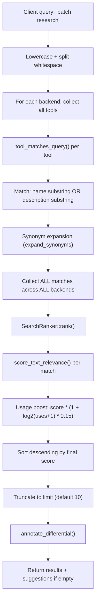
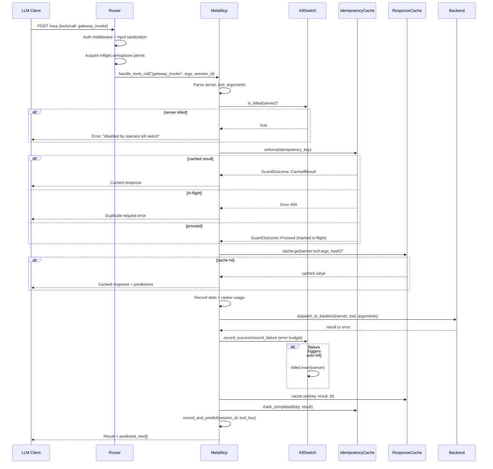
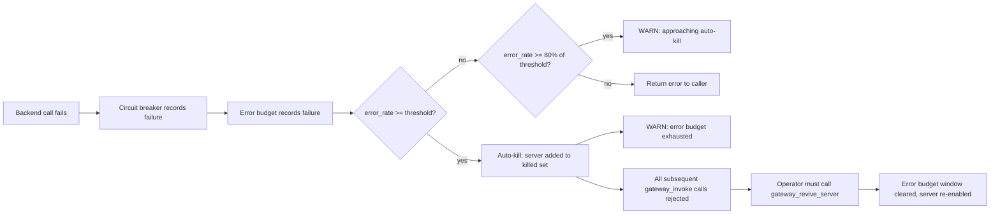

# Architecture

`mcp-gateway` v2.4.0 -- Rust, 807 tests, ~178 tools across backends.

## System Overview

The gateway sits between LLM clients (Claude Code, Cursor, etc.) and multiple MCP tool servers. Instead of loading all ~178 tool definitions into context (thousands of tokens), clients connect to the gateway and use a small set of **meta-tools** to discover and invoke tools on demand. This yields ~95% context token savings.

```
                            +-----------------------+
   LLM Client ──POST /mcp──▶  mcp-gateway           │
   (Claude Code)            │                       │
                            │  MetaMcp              │
                            │   ├─ SearchRanker     │
                            │   ├─ KillSwitch       │
                            │   ├─ IdempotencyCache │
                            │   ├─ ResponseCache    │
                            │   └─ TransitionTracker│
                            │                       │
                            │  BackendRegistry      │
                            │   ├─ stdio backends   │──▶ MCP servers (processes)
                            │   ├─ HTTP backends    │──▶ MCP servers (remote)
                            │   └─ CapabilityBackend│──▶ REST APIs (direct)
                            +-----------------------+
```

The gateway exposes a single HTTP endpoint (`/mcp`) that speaks MCP JSON-RPC. Clients discover backends via `gateway_search_tools`, then invoke them via `gateway_invoke`. The gateway handles routing, caching, failsafes, and lifecycle management internally.

## Meta-Tools

The gateway advertises up to 9 meta-tools to connecting clients. The base set of 4 is always present; the rest are conditional on configuration.

| Tool | Always | Purpose |
|------|--------|---------|
| `gateway_list_servers` | yes | List all registered backends with status and circuit state |
| `gateway_list_tools` | yes | List tools from one backend (or all). Uses cached tool lists |
| `gateway_search_tools` | yes | Keyword search across all backends with ranked results |
| `gateway_invoke` | yes | Call any tool on any backend. Handles caching, idempotency, kill switch |
| `gateway_get_stats` | if stats enabled | Usage stats: invocations, cache hits, token savings, top tools, cost |
| `gateway_webhook_status` | if webhooks enabled | List webhook endpoints and delivery stats |
| `gateway_run_playbook` | yes | Execute a multi-step playbook as a single call |
| `gateway_kill_server` | yes | Operator kill switch: immediately disable routing to a backend |
| `gateway_revive_server` | yes | Re-enable a killed backend and reset its error budget |

Defined in `src/gateway/meta_mcp_helpers.rs`, function `build_meta_tools()` (line 347).

## Tool Discovery Resolution Order

When `gateway_search_tools` receives a query, the full pipeline is:



### Matching (`tool_matches_query`, `meta_mcp_helpers.rs:367`)

A tool matches if **any** query word (or any of its synonyms) appears case-insensitively in the tool name or description. Multi-word queries use OR semantics for matching, but AND semantics score higher during ranking.

### Scoring tiers (`score_text_relevance`, `ranking.rs:175`)

Text relevance is scored in discrete tiers:

| Score | Condition |
|-------|-----------|
| 15 | All query words found in tool name |
| 10+2N | All N words found in name+description combined |
| 10 | Exact single-word name match |
| 6+2N | N words match `[keywords: ...]` tags |
| 4+2N | N words match `[schema: ...]` field names |
| 3+2M | M of N words found (partial) |
| 6 | Single word matches a schema field |
| 5 | Name contains query as substring |
| 2 | Description contains query as substring |

Synonym-expanded matches apply a 0.8x multiplier. Schema matches are never synonym-discounted.

### Usage boost (`SearchRanker::rank`, `ranking.rs:383`)

Final score = `text_relevance * (1 + log2(usage_count + 1) * 0.15)`

Usage is multiplicative: it amplifies good matches but cannot promote irrelevant tools.

### Keyword auto-tagging (`autotag.rs`)

MCP backend tools lack the `[keywords: ...]` tags that capability tools carry. `enrich_description()` auto-extracts up to 7 keywords from a tool's description: tokenize on non-alphabetic boundaries, lowercase, filter stopwords and short words, sort by descending length, truncate. Idempotent -- already-tagged descriptions pass through unchanged.

### Differential descriptions (`gateway/differential.rs`)

When search results contain multiple tools from the same "family" (same server + same `snake_case` prefix, e.g. `gmail_search`, `gmail_send`, `gmail_batch_modify`), the `annotate_differential()` function computes what makes each tool unique by removing words shared across all family members. The `differential_description` field is appended alongside the original `description`.

### Zero-result suggestions (`meta_mcp_helpers.rs:396`)

When no tools match, `build_suggestions()` scans all keyword tags for prefix or substring overlap with the query and returns up to 5 sorted suggestions.

## Server Lifecycle State Machine

```mermaid
stateDiagram-v2
    [*] --> Registered: Gateway::new() registers backend
    Registered --> WarmStarting: tokio::spawn warm-start task
    WarmStarting --> Active: backend.start() + get_tools() succeeds
    WarmStarting --> Failed: start or prefetch fails
    Failed --> Active: manual retry via gateway_list_tools(server=X)

    Active --> CircuitOpen: failure_threshold exceeded
    CircuitOpen --> HalfOpen: reset_timeout elapses
    HalfOpen --> Active: success_threshold reached
    HalfOpen --> CircuitOpen: failure in half-open

    Active --> Killed: KillSwitch::kill() or error budget auto-kill
    Killed --> Active: KillSwitch::revive() (resets error budget)

    Active --> HealthCheckFailed: ping fails
    HealthCheckFailed --> Active: next ping succeeds
```

### Registration (`gateway/server.rs:48`)

`Gateway::new()` iterates `config.enabled_backends()`, creates `Backend` instances with transport config and failsafe settings, registers them in `BackendRegistry`.

### Warm-start (`gateway/server.rs:348`)

A spawned task connects each backend and prefetches its tool list into cache. If `config.meta_mcp.warm_start` is empty, ALL backends are warmed.

### Health check (`gateway/server.rs:397`)

A periodic task sends `ping` to every running backend at `health_config.interval`. Failures are logged but do not directly kill the backend (the circuit breaker and error budget handle that).

### Circuit breaker (`failsafe/circuit_breaker.rs`)

Per-backend `CircuitBreaker` with three states: `Closed` (allowing), `Open` (blocking), `HalfOpen` (testing). Configured via `failure_threshold`, `success_threshold`, `reset_timeout`. The `Failsafe` wrapper (`failsafe/mod.rs`) combines circuit breaker, rate limiter, retry policy, and health tracker.

### Kill switch (`kill_switch.rs`)

`KillSwitch` provides two mechanisms sharing a single `DashSet<String>` of killed server names:

1. **Operator control** -- `kill(server)` / `revive(server)`, exposed as meta-tools.
2. **Error budget** -- sliding-window error-rate tracker (`BudgetWindow`). When a backend's error rate exceeds `ErrorBudgetConfig::threshold` (default 0.5) within the window (default 100 calls / 5 minutes), it is auto-killed. An 80% warning is logged before the threshold is reached. `revive()` resets the window.

## Request Flow



### Session tracking

Each SSE connection gets a `Mcp-Session-Id` header. The `session_id` is forwarded to `invoke_tool` for per-session transition tracking.

### Idempotency (`idempotency.rs`)

Three-state machine: `InFlight(Instant)` -> `Completed(Value, Instant)`, or removed on failure. Key derivation: `SHA-256(server:tool || \0 || canonical_json(arguments))`. TTLs: in-flight 5 minutes, completed 24 hours. Background cleanup task evicts stale entries.

### Transition tracking (`transition.rs`)

`TransitionTracker` learns `tool_A -> tool_B` transition frequencies across sessions. After each successful invocation, `predict_next(tool, 0.30, 3)` returns candidates with >= 30% confidence and >= 3 observations. Predictions are appended as `predicted_next` in the response JSON.

## Failure Cascade Behavior



The circuit breaker and error budget operate at different granularities:

- **Circuit breaker** (`failsafe/circuit_breaker.rs`): per-backend, configured per-backend via `FailsafeConfig`. Operates at the transport level -- blocks requests to a backend whose connection is failing. Resets automatically after `reset_timeout`.
- **Error budget** (`kill_switch.rs`): per-backend sliding window at the gateway level. Tracks business-logic failures (tool errors, not just transport). Requires manual `gateway_revive_server` to recover.

On dispatch failure, the idempotency entry is removed (`idem_cache.remove(key)`) so the call becomes retryable.

## Module Map

| Module | Path | Description |
|--------|------|-------------|
| `autotag` | `src/autotag.rs` | Auto-extracts keyword tags from MCP tool descriptions for search indexing |
| `backend` | `src/backend/` | Backend connection management, tool/resource/prompt caching, transport dispatch |
| `cache` | `src/cache.rs` | TTL-based response cache with SHA-256 keying and max-size eviction |
| `capability` | `src/capability/` | YAML-defined REST API tools: definition, parsing, execution, schema validation, hot-reload |
| `cli` | `src/cli.rs` | Clap-based CLI: subcommands for serve, validate, discover, capability management |
| `config` | `src/config.rs` | Figment-based configuration from YAML + env vars |
| `discovery` | `src/discovery/` | Auto-discovery of MCP servers from common config locations and running processes |
| `error` | `src/error.rs` | Unified error types with JSON-RPC error code mapping |
| `failsafe` | `src/failsafe/` | Circuit breaker, rate limiter, retry policy, health tracker per backend |
| `gateway` | `src/gateway/` | HTTP server, router, Meta-MCP handler, streaming, webhooks, auth, differential |
| `idempotency` | `src/idempotency.rs` | Prevents duplicate side effects on LLM retries via SHA-256 keyed state machine |
| `kill_switch` | `src/kill_switch.rs` | Operator kill switch + per-backend sliding-window error budget with auto-kill |
| `oauth` | `src/oauth/` | OAuth 2.0 Authorization Code + PKCE flow for backend authentication |
| `playbook` | `src/playbook.rs`, `src/playbook/` | Multi-step tool chains: YAML-defined, variable interpolation, error strategies |
| `protocol` | `src/protocol/` | MCP JSON-RPC types for versions 2024-10-07 through 2025-11-25 |
| `ranking` | `src/ranking.rs` | Search scoring: text relevance tiers, synonym expansion, usage-based boost, persistence |
| `registry` | `src/registry.rs` | Community capability registry: discovery and installation from local/GitHub sources |
| `secrets` | `src/secrets.rs` | Credential resolution: `{keychain.SERVICE}`, `{env.VAR}`, `{oauth:provider}` |
| `security` | `src/security/` | Input sanitization (XSS), SSRF URL validation, tool access policy enforcement |
| `stats` | `src/stats.rs` | Usage statistics: invocations, cache hits, per-tool counts, token savings calculation |
| `transform` | `src/transform.rs`, `src/transform/` | Response transform pipeline: field selection, stripping noise from API responses |
| `transition` | `src/transition.rs` | Session-scoped tool sequence learning and predictive next-tool suggestions |
| `transport` | `src/transport/` | MCP transport implementations: stdio (process spawn), HTTP (Streamable HTTP + SSE) |
| `validator` | `src/validator/` | MCP server design validator: checks agent-UX compliance against best practices |

## Key Data Structures

### `MetaMcp` (`gateway/meta_mcp.rs:51`)

Central request handler. Holds `Arc` references to all subsystems:

```rust
pub struct MetaMcp {
    backends: Arc<BackendRegistry>,              // MCP server connections
    capabilities: RwLock<Option<Arc<CapabilityBackend>>>,  // Direct REST API tools
    cache: Option<Arc<ResponseCache>>,           // Response cache for invoke
    idempotency_cache: Option<Arc<IdempotencyCache>>,      // Dedup LLM retries
    stats: Option<Arc<UsageStats>>,              // Usage tracking
    ranker: Option<Arc<SearchRanker>>,           // Usage-weighted search ranking
    transition_tracker: RwLock<Option<Arc<TransitionTracker>>>,  // Predictive prefetch
    playbook_engine: RwLock<PlaybookEngine>,     // Multi-step tool chains
    kill_switch: Arc<KillSwitch>,                // Operator disable + error budget
    error_budget_config: RwLock<ErrorBudgetConfig>,  // Auto-kill thresholds
    webhook_registry: RwLock<Option<Arc<..>>>,   // Inbound webhook routing
    log_level: RwLock<LoggingLevel>,             // Gateway-wide log level
}
```

### `KillSwitch` (`kill_switch.rs:32`)

Lock-free concurrent reads via `DashSet` (checked on every `gateway_invoke`). Per-backend `BudgetWindow` tracks success/failure in a `VecDeque<(Instant, bool)>` with size cap and time-based eviction.

```rust
pub struct KillSwitch {
    killed: DashSet<String>,                          // O(1) is_killed() check
    budgets: DashMap<String, Arc<Mutex<BudgetWindow>>>,  // Sliding window per backend
}
```

### `IdempotencyCache` (`idempotency.rs:91`)

`DashMap<String, IdempotencyState>` where state is `InFlight(Instant)` or `Completed(Value, Instant)`. Key derivation via `SHA-256(tool_name + \0 + canonical_json(args))`. Background cleanup task via `spawn_cleanup_task()`.

### `TransitionTracker` (`transition.rs:54`)

Double-keyed `DashMap`: outer key = "from_tool", inner key = "to_tool", value = `AtomicU64` count. Per-session last-tool tracked separately. Predictions require both minimum count (3) and minimum confidence (30%). Persisted to `~/.mcp-gateway/transitions.json` on shutdown.

### `SearchRanker` (`ranking.rs:328`)

`DashMap<String, AtomicU64>` of usage counts keyed by `"server:tool"`. Persisted to `~/.mcp-gateway/usage.json`. Loaded on startup, saved on graceful shutdown.

### `SchemaValidator` (`capability/schema_validator.rs`)

Validates LLM-supplied arguments against capability YAML schemas before HTTP dispatch. Five-step pipeline: required params, unknown params, type validation with coercion (string-to-int, string-to-bool), enum values, string/numeric constraints. Error messages are structured for LLM consumption.

### `ResponseCache` (`cache.rs`)

`DashMap<String, CachedResponse>` with per-entry TTL. Keys computed from `SHA-256(server:tool:canonical_args)`. Supports bounded `max_entries` with eviction. Atomic hit/miss/eviction counters.

## Persistence

| Data | File | Loaded | Saved |
|------|------|--------|-------|
| Search ranking usage counts | `~/.mcp-gateway/usage.json` | Startup | Graceful shutdown |
| Transition frequencies | `~/.mcp-gateway/transitions.json` | Startup | Graceful shutdown |

Both use JSON serialization. The transition tracker's `load()` merges with in-memory state, allowing hot-reload without losing in-flight session data.

## Configuration

Loaded via Figment (`config.rs`): YAML file + environment variable overrides. Key sections:

- `server` -- host, port, shutdown timeout
- `backends` -- map of backend name to transport config (stdio command or HTTP URL)
- `meta_mcp` -- enabled, warm_start list, cache TTL
- `failsafe` -- circuit breaker, rate limit, retry, health check settings
- `capabilities` -- enabled, directories, backend name
- `playbooks` -- enabled, directories
- `webhooks` -- enabled, base path
- `auth` -- bearer token, API keys
- `security` -- sanitize_input, ssrf_protection, tool_policy
- `cache` -- enabled, default_ttl, max_entries
- `streaming` -- enabled, auto_subscribe backends

## Graceful Shutdown

1. SIGINT/SIGTERM received
2. Broadcast shutdown signal to health check and idle checker tasks
3. Save ranker usage data and transition tracking data to disk
4. Drain in-flight requests: acquire all 10,000 semaphore permits (with timeout from `config.server.shutdown_timeout`)
5. Stop all backends (`BackendRegistry::stop_all()`)

Implemented in `gateway/server.rs:441-491`.

## Dependencies

Runtime: `axum` (HTTP), `tokio` (async), `reqwest` (HTTP client), `tower` (middleware), `serde_json` (serialization), `dashmap` (concurrent maps), `parking_lot` (fast locks), `governor` (rate limiting), `notify` (file watching for hot-reload), `figment` (config), `sha2`/`hmac` (hashing/signatures).

No `unsafe` code (enforced via `#![forbid(unsafe_code)]`).
