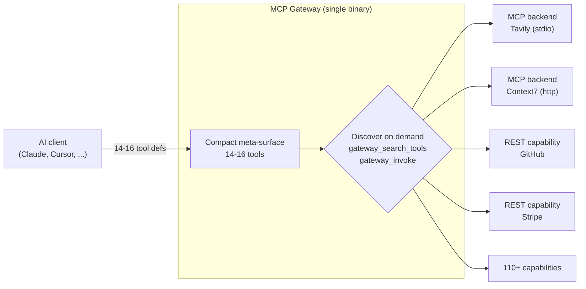
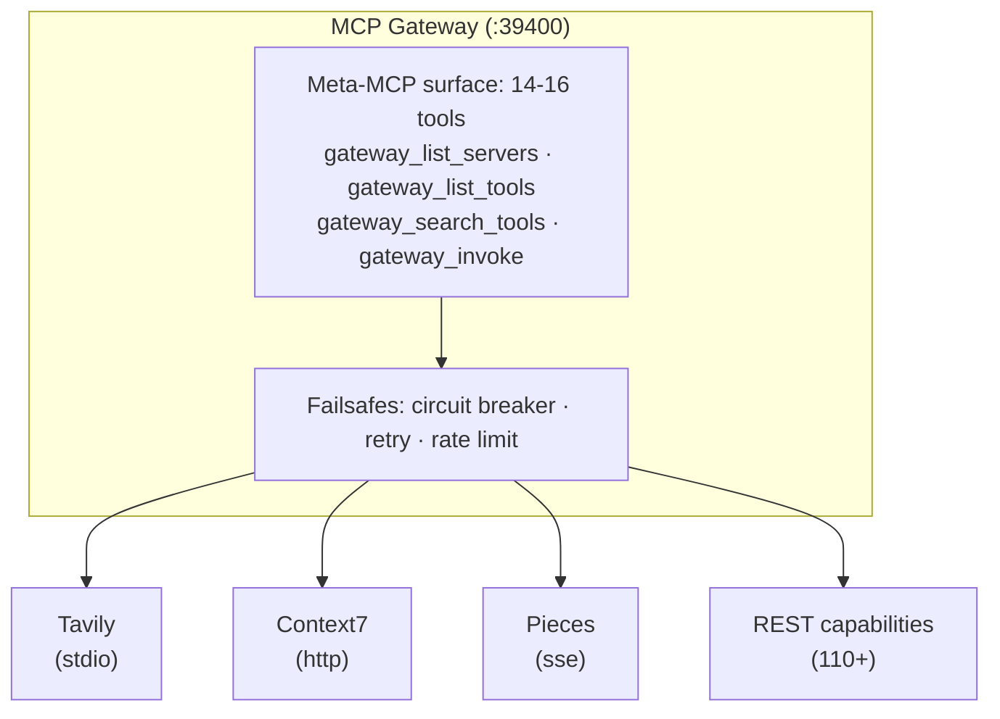

# MCP Gateway

[](https://github.com/MikkoParkkola/mcp-gateway/actions/workflows/ci.yml)
[](https://crates.io/crates/mcp-gateway)
[](https://crates.io/crates/mcp-gateway)
[](https://www.rust-lang.org)
[](https://github.com/MikkoParkkola/mcp-gateway/blob/main/LICENSES.md)
[](https://github.com/rust-secure-code/safety-dance/)
[](https://deps.rs/repo/github/MikkoParkkola/mcp-gateway)
[](https://github.com/MikkoParkkola/mcp-gateway/tree/main/capabilities)
[](https://modelcontextprotocol.io)
[](docs/OWASP_AGENTIC_AI_COMPLIANCE.md)
[](https://glama.ai/mcp/servers/MikkoParkkola/mcp-gateway)
[](https://glama.ai/mcp/servers/MikkoParkkola/mcp-gateway)
[](https://insiders.vscode.dev/redirect/mcp/install?name=mcp-gateway&config=%7B%22command%22%3A%22mcp-gateway%22%2C%22args%22%3A%5B%22serve%22%2C%22--stdio%22%5D%7D)
[](cursor://anysphere.cursor-deeplink/mcp/install?name=mcp-gateway&config=%7B%22command%22%3A%22mcp-gateway%22%2C%22args%22%3A%5B%22serve%22%2C%22--stdio%22%5D%7D)

**One gateway between your AI and every tool it needs, without flooding the context window.**

MCP Gateway is a single Rust binary that sits between an AI client and all of its tools. Connect any number of MCP servers and REST APIs behind it, and the agent sees only a compact meta-surface of 14 to 16 tools instead of hundreds of tool definitions. It discovers and calls the right backend tool on demand. On a 100-tool stack that is about 89% less context-token overhead per request in the README [benchmark](docs/BENCHMARKS.md), and the answer to "how many tools can I connect" becomes "unlimited."


Personal and noncommercial use is free, including running the full gateway. Running it commercially needs a [commercial license](#license), and only a small MIT core of generic building blocks is MIT-licensed.

## The problem this removes

Every MCP tool an AI client connects costs roughly 150 tokens of context overhead, loaded into every request whether the tool gets used or not. Connect 20 servers with 100 tools between them and you spend about 15,000 tokens before the conversation starts. Context limits then force a second cost: you have to decide up front which tools to connect and leave the rest out, so the agent makes worse decisions because it cannot reach data you chose not to load.

MCP Gateway removes both costs. The agent loads a small fixed set of meta-tools, searches the full catalog with `gateway_search_tools`, and invokes any backend tool with `gateway_invoke` only when it needs it.



## Quick Start

**Four commands:**

```bash
brew trust --tap MikkoParkkola/tap   # Homebrew 6.0+
brew install MikkoParkkola/tap/mcp-gateway   # 1. install
mcp-gateway setup wizard --configure-client  # 2. import existing servers + wire up clients
mcp-gateway serve                            # 3. run
mcp-gateway doctor                           # 4. verify everything is healthy
```

That is it. Your AI clients now talk to the gateway, and the gateway routes to every backend you already had configured, at a flat `~15 tools` instead of `~150`. Start with `gateway_search_tools` from your AI client to find any backend tool, then invoke it with `gateway_invoke`.

> **Nothing to import yet?** `mcp-gateway init --with-examples` writes a working `gateway.yaml` with public capabilities so you can confirm the gateway is alive before adding your own servers.

**Or tell your AI assistant** (recommended):

> Read https://github.com/MikkoParkkola/mcp-gateway and install mcp-gateway to consolidate all my MCP servers behind one gateway

Your agent will install the binary, run the setup wizard, import your existing MCP servers, and wire itself up. This works in Claude Code, Cursor, Windsurf, Codex, and any AI with terminal access.

### Install

| Method | Command |
|--------|---------|
| **Homebrew (macOS/Linux, recommended)** | `brew install MikkoParkkola/tap/mcp-gateway` |
| **Cargo** | `cargo install mcp-gateway` |
| **cargo-binstall** | `cargo binstall mcp-gateway` |
| **Direct binary download (Windows x64)** | Download `mcp-gateway-windows-x86_64.exe` from the [latest release](https://github.com/MikkoParkkola/mcp-gateway/releases/latest) |
| **Docker** | `docker run -v $(pwd)/gateway.yaml:/config.yaml ghcr.io/mikkoparkkola/mcp-gateway:latest --config /config.yaml` |

<details>
<summary>Direct binary download</summary>

```bash
# macOS Apple Silicon
curl -L https://github.com/MikkoParkkola/mcp-gateway/releases/latest/download/mcp-gateway-darwin-arm64 -o mcp-gateway && chmod +x mcp-gateway

# macOS Intel
curl -L https://github.com/MikkoParkkola/mcp-gateway/releases/latest/download/mcp-gateway-darwin-x86_64 -o mcp-gateway && chmod +x mcp-gateway

# Linux x86_64
curl -L https://github.com/MikkoParkkola/mcp-gateway/releases/latest/download/mcp-gateway-linux-x86_64 -o mcp-gateway && chmod +x mcp-gateway
```

```powershell
# Windows x64 (PowerShell)
Invoke-WebRequest -Uri https://github.com/MikkoParkkola/mcp-gateway/releases/latest/download/mcp-gateway-windows-x86_64.exe -OutFile mcp-gateway.exe
```

</details>

### Set up, three ways

#### Option A: auto-import everything (recommended)

```bash
mcp-gateway setup wizard --configure-client
```

Scans Claude Desktop, Claude Code, Cursor, Zed, Continue.dev, Codex, and running MCP processes; lets you pick which servers to import into `gateway.yaml`; previews the gateway entry; writes it into each detected client config; verifies the write; and prints backup and rollback paths when an existing client config changes. Add `--yes` to skip the prompts and import everything.

#### Option B: add servers from the built-in registry

48 popular MCP servers are pre-registered with the right command, args, and env-var template. `mcp-gateway add` is compatible with `claude mcp add` and `codex mcp add`:

```bash
mcp-gateway add tavily                                       # known server, fills env vars
mcp-gateway add my-server -- npx -y @some/mcp-server --flag  # arbitrary stdio command
mcp-gateway add --url https://mcp.sentry.dev/mcp sentry      # HTTP server
mcp-gateway add -e API_KEY=xxx my-server -- npx my-mcp-server
```

`mcp-gateway list` shows what is configured. `mcp-gateway remove <name>` removes one.

#### Option C: hand-write `gateway.yaml`

For the full schema reference, see [docs/QUICKSTART.md#configuration](docs/QUICKSTART.md#configuration). Minimal example:

```yaml
server:
  port: 39400

meta_mcp:
  enabled: true

backends:
  tavily:
    command: "npx -y @anthropic/mcp-server-tavily"
    description: "Web search"
    env:
      TAVILY_API_KEY: "${TAVILY_API_KEY}"

  sentry:
    http_url: "https://mcp.sentry.dev/mcp"
    description: "Sentry issues"
```

### Run and verify

```bash
mcp-gateway serve                  # start the gateway
mcp-gateway doctor                 # diagnose config, port, env vars, backend health
mcp-gateway doctor --fix           # auto-fix issues where possible
```

The web dashboard is at <http://localhost:39400/ui> once `serve` is running.

### Connect AI clients (if you skipped Option A)

`setup export` writes the gateway entry into client config files for you. It auto-detects the right path per client:

```bash
mcp-gateway setup export --target all --dry-run       # preview without writing
mcp-gateway setup export --target all                 # write, back up, verify
mcp-gateway setup export --target claude-code         # one client
mcp-gateway setup export --target all --watch         # regenerate on gateway.yaml changes
mcp-gateway setup export --rollback <backup-file>     # restore one client config
```

Existing client files are backed up before mutation. The command prints the exact rollback command beside each updated client.

| Client | Config path |
|--------|-------------|
| `claude-code` | `~/.claude.json` |
| `claude-desktop` | platform-specific |
| `cursor` | `.cursor/mcp.json` (workspace) |
| `vs-code-copilot` | `.vscode/mcp.json` (workspace) |
| `windsurf` | `~/.codeium/windsurf/mcp_config.json` |
| `cline` | `.cline/mcp_servers.json` (workspace) |
| `zed` | `~/.config/zed/settings.json` |

Modes: `--mode proxy` (HTTP), `--mode stdio` (subprocess), `--mode auto` (probe the health endpoint, then fall back).

<details>
<summary>Manual JSON snippet (if you prefer to edit by hand)</summary>

```json
{
  "mcpServers": {
    "gateway": {
      "type": "http",
      "url": "http://localhost:39400/mcp"
    }
  }
}
```

</details>

## Why use MCP Gateway?

- **About 89% less context overhead.** In the README benchmark, 100 backend tools cost roughly 1,600 tokens instead of 15,000, because the agent only loads the tools it uses this turn. Numbers are reproducible; see [Benchmarks](docs/BENCHMARKS.md).
- **Unlimited tools, discovered on demand.** No more choosing which servers fit the budget. The agent searches (`gateway_search_tools`) and invokes (`gateway_invoke`) tools as it needs them.
- **Add any REST API in minutes.** Drop in a YAML file or import an OpenAPI spec with `mcp-gateway cap import`. 110+ capabilities ship built in.
- **Per-user identity to backends.** Multitenant backends can receive the verified end-user identity with no gateway-stored credential. See [Multitenant identity](#end-user-identity-v31).
- **Secure by construction.** A tool-poisoning validator scans every backend tool description before it reaches the agent, SHA-256 pinning with rug-pull detection protects each capability, and the OWASP Agentic AI Top 10 is covered 10 out of 10. The whole binary is `#![forbid(unsafe_code)]`, with optional mTLS, message signing, and agent identity.
- **Swap your MCP stack without losing your session.** Hot-reload backends and config in about 8ms while the AI stays connected. No restart, no lost context.
- **Production resilience.** Circuit breakers, retries with backoff, rate limiting, and health checks keep one flaky server from taking down the whole toolchain.
- **Dual protocol.** MCP plus an A2A (agent-to-agent) transport adapter, so the same gateway routes tool calls and cross-provider agent messages.

### What MCP Gateway is, and what it is not

MCP Gateway is a tool and capability **router**. It routes MCP tool, resource, and prompt traffic to backend MCP servers and to capability-backed REST APIs, and it can proxy MCP server-to-client requests like `sampling/createMessage`, `elicitation/create`, and `roots/list` back to the connected client over the existing session.

It is not a chat-completions or embeddings proxy. When a backend asks for `sampling/createMessage`, the connected client performs the model call, not the gateway. The OpenAI-compatible prompt-cache helpers exist for one narrow reason: so `gateway_invoke` can preserve `prompt_cache_key` behavior for backends that call LLM APIs internally. That boundary is deliberate. The value here is routing hundreds of tools through a small surface, not sitting in the model path.

Compared with the default approach of loading every tool definition into every request, the gateway trades a one-time discovery hop for a flat, small context cost. Compared with generic transport bridges that expose one server at a time, it aggregates many backends behind one namespaced surface with integrity checks, ranking, and per-user identity.

<a id="end-user-identity-v31"></a>

## Multitenant identity

A multitenant backend (email, memory, calendar) that runs its own OIDC normally sees only "the gateway," so it cannot enforce per-user access or produce a per-user audit trail. mcp-gateway propagates the verified end-user identity to the backend through one of three configured strategies. It can mint a short-lived gateway-signed assertion, forward the caller's own token, or run an RFC 8693 token exchange for OAuth-native backends. It keeps no long-lived credential for anyone. A backend marked `required` fails closed rather than serve a shared key when no verified identity is present, and per-user results stay isolated in the cache. See [ADR-007](docs/adr/ADR-007-identity-propagation.md), [ADR-008](docs/adr/ADR-008-multi-user-oauth-isolation.md), and [docs/UPGRADING-3.0.md](docs/UPGRADING-3.0.md).

### Independent reviews

- [Five MCP hot-reload tools compared](https://ruachtov.ai/blog/five-tools-mcp-restart.html): Ruach Tov Collective's BPD-based comparison of mcp-gateway against four restart-focused alternatives, with a feature matrix and architectural analysis.
- [mcp-gateway deep dive](https://ruachtov.ai/blog/mcp-gateway-deep-dive.html): a walkthrough of the capability system, SHA-256 integrity pinning, and the v2.5 to v2.9 development arc.

Quantitative claims in this README are sourced from [docs/BENCHMARKS.md](docs/BENCHMARKS.md) and the machine-readable [benchmarks/public_claims.json](benchmarks/public_claims.json), with a CI check that fails on drift. The public Trust Fabric plan is tracked in [docs/roadmap/mik-6550-trust-fabric-roadmap.md](docs/roadmap/mik-6550-trust-fabric-roadmap.md).

## Why the token math matters

Every MCP tool you connect costs about 150 tokens of context overhead. Connect 20 servers with 100 tools and you have burned roughly 15,000 tokens before the first message, on definitions the AI probably will not use this turn. Worse, context limits force you to choose which tools to connect at all, so the agent makes weaker decisions because the right data is out of reach.

| | Without gateway | With gateway |
|---|----------------|--------------|
| **Tools in context** | Every definition, every request | 16 meta-tools in the README benchmark (~1,600 tokens) |
| **Token overhead** | ~15,000 tokens (100 tools) | ~1600 tokens, **89% savings** |
| **Cost at scale** | ~$0.22 per request (Opus input) | ~$0.024 per request, **$201 saved per 1K** |
| **Practical tool limit** | 20 to 50 tools under context pressure | Unlimited, discovered on demand |
| **Connect a new REST API** | Build an MCP server (days) | Drop a YAML file or import an OpenAPI spec (minutes) |
| **Changing MCP config** | Restart the AI session, lose context | Restart gateway (~8ms), session stays alive |
| **When one tool breaks** | Cascading failures | Circuit breakers isolate it |

The gateway exposes 14 tools minimum, 16 in the README benchmark scenario, 17 when webhook status is surfaced. The base discovery quartet stays fixed; the rest are operator helpers for stats, cost, playbooks, profile control, disabled-capability visibility, reload, and webhook status.


## Security

Connecting N MCP servers to an agent means accepting N attack surfaces. Tool poisoning, rug pulls, and exfiltration through hidden instructions in tool descriptions are demonstrated attacks, not hypotheticals. Invariant Labs' writeup ([MCP Security Notification: Tool Poisoning Attacks](https://invariantlabs.ai/blog/mcp-security-notification-tool-poisoning-attacks)) and Simon Willison's summary ([MCP has prompt injection security problems](https://simonwillison.net/2025/Apr/9/mcp-prompt-injection/)) lay out the threat model.

mcp-gateway puts every backend tool description behind one audit surface and defends it structurally:

- **Tool-poisoning validator (AX-010).** Every backend tool description is scanned before it reaches the agent's context window. HIGH patterns fail closed: `<IMPORTANT>` blocks, `~/.ssh`/`~/.aws`/`id_rsa`/`.env`/`/etc/passwd`, `sidenote` exfiltration language, `curl .* https?://`, and `base64` in an exfil context. MEDIUM patterns warn: 40+ consecutive spaces, zero-width or bidi-override Unicode, and oversized descriptions. Implementation: [`src/validator/rules/tool_poisoning.rs`](src/validator/rules/tool_poisoning.rs) (19 tests).
- **SHA-256 capability hash-pinning.** `mcp-gateway cap pin <file>` writes a `sha256:` line over the file's canonical hash (`grep -v '^sha256:' capability.yaml | sha256sum` reproduces it from any shell). The loader refuses any mismatched file on load and on every watcher event.
- **Rug-pull detection.** When a pinned capability's on-disk content changes after approval, the watcher unloads it and logs `RUG-PULL DETECTED`. The capability stays quarantined until an operator re-pins it. Implementation: [`src/capability/hash.rs`](src/capability/hash.rs) and `detect_rug_pulls` in [`src/capability/backend.rs`](src/capability/backend.rs).
- **Centralized audit surface.** Capability YAMLs are plain text: diffable, greppable, and reviewable in a PR. The agent only ever sees the compact meta-surface, so there is no N-server tool-list pollution and no N-server attack surface.

Full walkthrough, PoC snippets, and roadmap: [docs/blog/security-aware-mcp-gateway.md](docs/blog/security-aware-mcp-gateway.md).

- **OWASP Agentic AI Top 10.** Controls are covered across all 10 ASI risks at the gateway boundary, with hardening follow-ups tracked separately for SBOMs, release signing, live remote attestation discovery, multi-gateway signing, SQL-sink defaults, and collusion detection. See [docs/OWASP_AGENTIC_AI_COMPLIANCE.md](docs/OWASP_AGENTIC_AI_COMPLIANCE.md).

### Recent additions

- **OpenAPI importer.** `mcp-gateway cap import <spec-url-or-file>` turns an OpenAPI 3 spec into one validated capability YAML per operation. The full Swagger Petstore spec becomes 19 validated capability YAMLs end to end:
  ```bash
  mcp-gateway cap import https://petstore3.swagger.io/api/v3/openapi.json --output capabilities/ --prefix petstore
  ```
  22 tests across [`src/capability/openapi.rs`](src/capability/openapi.rs) and [`tests/openapi_import_tests.rs`](tests/openapi_import_tests.rs).

## Architecture



Single-binary gateway. An AI client talks to the compact meta-surface, and the gateway dynamically discovers and routes to backend tools. Key modules: `gateway/` (core router, OAuth, streaming, UI), `provider/` (MCP/composite/capability), `capability/` (discovery, validation), `transport/` (HTTP, stdio), `security/` (firewall, mTLS, message signing, agent identity, memory scanner), `identity_propagation/`, `key_server/`, `cost_accounting/`, `scheduler/`, `skills/`, `tool_profiles/`, `config_reload/`, and `a2a/` (A2A transport adapter).

## Features

### Web dashboard

Embedded web UI at `/ui`: live status, searchable tools, server health, a read-only control-plane view, and a config viewer. Operator dashboard at `/dashboard`. Cost tracking at `/ui#costs`. All served from the same binary and port, with no frontend build step.

### Security and governance

| Feature | Description | Docs |
|---------|-------------|------|
| **Authentication** | Bearer tokens, API keys, explicit admin keys, per-client rate limits, and opt-in per-client circuit breakers | [examples/per-client-tool-scopes.yaml](examples/per-client-tool-scopes.yaml) |
| **End-user identity propagation** | Three configured strategies (`identity_propagation` config): gateway-signed assertion, client-token passthrough, and RFC 8693 token exchange. Fails closed when a backend requires identity. Per-user cache isolation. Enforced on dispatch, Code Mode, and direct routes. | [docs/adr/ADR-007-identity-propagation.md](docs/adr/ADR-007-identity-propagation.md) |
| **Per-user OAuth isolation** | Fail-closed default (v3.0): a backend that requires a per-user OAuth identity refuses a call that lacks one instead of serving a shared stored token. Opt into the previous shared-credential behavior with `auth.single_user: true` (personal gateway) or `oauth.shared_account: true` (a specific backend). Upgrading from 2.x backs up `gateway.yaml` and prints a one-time posture notice; no config changes automatically. | [docs/adr/ADR-008-multi-user-oauth-isolation.md](docs/adr/ADR-008-multi-user-oauth-isolation.md), [docs/UPGRADING-3.0.md](docs/UPGRADING-3.0.md) |
| **Per-client tool scopes** | Allowlist or denylist tools per API key with glob patterns | [examples/per-client-tool-scopes.yaml](examples/per-client-tool-scopes.yaml) |
| **Security firewall** | Credential redaction, prompt-injection detection, and shell/SQL/path-traversal scanning | [CHANGELOG](CHANGELOG.md#260---2026-03-13) |
| **Cost governance** | Per-tool, per-key, daily budgets with alert thresholds (log/notify/block) | [CHANGELOG](CHANGELOG.md#260---2026-03-13) |
| **Session sandboxing** | Per-session call limits, duration caps, backend restrictions | [CHANGELOG](CHANGELOG.md#250---2026-03-12) |
| **mTLS** | Certificate-based auth for tool execution | [CHANGELOG](CHANGELOG.md#240---2026-02-25) |

### Integration and discovery

The gateway ships with **110+ built-in capabilities**: weather, Wikipedia, GitHub, stock quotes, package tracking, and more. Capability YAMLs hot-reload automatically after file changes, no restart needed.

| Feature | Description |
|---------|-------------|
| **Capability system** | REST API to MCP tool via YAML. Hot-reloaded. [110+ built-in](capabilities/). OpenAPI import supported. |
| **Transform chains** | Namespace, filter, rename, and response transforms. [Example](examples/transform-example.yaml). |
| **Webhooks** | GitHub/Linear/Stripe push events as MCP notifications. [Docs](docs/WEBHOOKS.md). |
| **Auto-discovery** | Discover MCP servers from existing client configs and running processes. |
| **Surfaced tools** | Pin high-value tools directly in `tools/list` for one-hop invocation. |
| **Semantic search** | TF-IDF ranked search across all tool names and descriptions. |
| **Tool profiles** | Usage analytics per tool: latency, errors, trends. Persisted to disk. |
| **Config export** | Export sanitized config as YAML or JSON via `mcp-gateway config export`. |

### Protocol and transport

- **MCP version**: 2025-11-25 (latest spec)
- **Transports**: stdio, Streamable HTTP, SSE, WebSocket
- **Hot reload**: capability YAMLs plus reloadable gateway config sections are watched and reloaded live
- **Reload outcomes**: `gateway_reload_config` and `/ui/api/reload` return `restart_required` for listener changes (for example `server.host` or `server.port`); `env_files` list edits remain startup-only
- **Config discovery**: auto-finds `gateway.yaml` in cwd, `~/.config/mcp-gateway/`, and `/etc/mcp-gateway/`
- **"Did you mean?"**: Levenshtein-based typo correction on tool names
- **Tool annotations**: MCP 2025-11-25 `title`, `readOnlyHint`, `destructiveHint`, `idempotentHint`, `openWorldHint`; gateway meta-tools are fully annotated, while backend tools use the hybrid pass-through/fill policy in [ADR-003](docs/adr/ADR-003-mcp-tool-annotation-policy.md)
- **Dynamic descriptions**: live tool and server counts in meta-tool descriptions
- **Tunnel mode**: expose via Tailscale or pipenet without opening ports
- **Shell completions**: `mcp-gateway completions bash|zsh|fish`
- **Spec preview** (opt-in): filtered `tools/list` (SEP-1821), `tools/resolve` (SEP-1862), dynamic promotion

### Supported backends

Any MCP-compliant server works. All three transport types are supported:

| Transport | Examples |
|-----------|---------|
| **stdio** | `@anthropic/mcp-server-tavily`, `@modelcontextprotocol/server-filesystem`, `@modelcontextprotocol/server-github` |
| **HTTP** | Any Streamable HTTP server |
| **SSE** | Pieces, LangChain, [GitMCP](https://gitmcp.io) (free remote docs and code search for any GitHub repo) |

Remote MCP servers plug in by URL, with no extra code. See [examples/gateway-full.yaml](examples/gateway-full.yaml) for a commented GitMCP backend entry and [docs/REMOTE_BACKENDS.md](docs/REMOTE_BACKENDS.md) for a step-by-step walkthrough.

## Public MCP Gateway Comparison

This table compares public, user-facing behavior, not internal roadmap scoring. MCP Gateway entries are grounded in this repo's public docs: [quickstart](QUICKSTART.md), [deployment](docs/DEPLOYMENT.md), [OWASP controls](docs/OWASP_AGENTIC_AI_COMPLIANCE.md), [TrustCard/CBOM](docs/trustcard.md), [CatalogTrustLab](docs/catalog_trust_lab.md), [adaptive ranking](docs/adaptive_ranking.md), and the [Trust Fabric roadmap](docs/roadmap/mik-6550-trust-fabric-roadmap.md). Competitor entries are grounded in public project docs: [Docker MCP Catalog and Toolkit](https://docs.docker.com/ai/mcp-catalog-and-toolkit/), [MCPJungle README](https://github.com/mcpjungle/MCPJungle), [mcpo README](https://github.com/open-webui/mcpo), and [Supergateway README](https://github.com/supercorp-ai/supergateway).

| Axis | **MCP Gateway** | **[Docker MCP Gateway / Toolkit](https://docs.docker.com/ai/mcp-catalog-and-toolkit/)** | **[MCPJungle](https://github.com/mcpjungle/MCPJungle)** | **[mcpo](https://github.com/open-webui/mcpo) / [Supergateway](https://github.com/supercorp-ai/supergateway)** |
|---|---|---|---|---|
| Primary job | MCP and REST capability router with a compact meta-surface | Docker-managed catalog, profiles, containerized MCP servers, and gateway | Self-hosted gateway that runs many MCP servers behind one endpoint | Protocol bridges: MCP to OpenAPI for mcpo; stdio to SSE/WS for Supergateway |
| Install | Standalone Rust binary via cargo, Homebrew, VS Code, Cursor, and local build | Docker Desktop / Docker CLI plugin flow | Self-hosted gateway install and server registration | Python/uvx/Docker for mcpo; npm/CLI bridge for Supergateway |
| Configuration | Wizard, local starter profile, service templates, client export, doctor JSON, backup and rollback | Docker profiles and catalog selection | Centralized server and client configuration | Per-bridge command/config for each exposed server or transport |
| Security | OWASP Agentic AI matrix, firewall, response inspection, hash-pinned capabilities, mTLS/signing options | Verified container images with versioning, provenance, and security updates in Docker catalog | Centralized access control and observability | Transport/API exposure layer; security depends on bridge auth and deployment boundary |
| Identity and grants | Local identity-grant contract and CLI, per-user identity propagation to backends, plus enterprise governance boundary | Docker/team controls depend on Docker organization setup | Authenticated clients and server access control | Not a grant engine; delegates identity policy to the surrounding deployment |
| Runtime isolation | RuntimeProvider policy planning plus Docker/Podman/Kubernetes deployment paths | Container-first isolation is the core runtime model | Runs and manages MCP servers behind the gateway | Bridges existing server processes/transports rather than isolating arbitrary tools |
| Trust metadata | TrustCard/CBOM generation, validation, TrustLab evidence, provenance stubs | Catalog packages carry image provenance and security update flow | Gateway inventory and observability focus | Protocol metadata bridge; trust metadata is not the primary product surface |
| Discovery | Meta-MCP listing/search, ShadowRadar unmanaged-server inventory, capability registry | Docker MCP Catalog of packaged servers | Centralized discovery across configured servers | Exposes one bridged server surface at a time unless composed externally |
| Policy and governance | Policy, grants, audit events, read-only control-plane tab/API, enterprise evidence boundary | Docker org/catalog/profile policy model | Centralized access control for teams | No broad governance plane; use with another policy layer when needed |
| Imports and bridges | Native MCP backends plus REST capability YAML and protocol-import planning | Docker-packaged MCP server catalog | MCP server aggregation | Strong bridge story for OpenAPI, SSE, WebSocket, and stdio compatibility |
| Ranking and routing | Safety-aware ranking, explanations, cost/latency/trust/health signals | Catalog/profile selection, not an MCP tool ranker | Gateway-level routing to configured servers | Transport routing, not semantic tool ranking |
| Deployment | Local, team gateway, Docker Compose, systemd, launchd, and enterprise Kubernetes alpha manifests | Docker Desktop, Docker CLI, Docker Hub/catalog workflow | Local or shared self-hosted gateway | Local or remote bridge process beside the target MCP server |
| Licensing | Noncommercial-default (PolyForm-NC) with a small MIT core of generic building blocks; commercial use of the runnable gateway requires a license | Docker product and repository licensing apply | See project repository license | See each bridge repository license |

### vs Anthropic MCP tunnels

On 2026-05-19 Anthropic shipped [Claude Managed Agents](https://claude.com/blog/claude-managed-agents-updates) with self-hosted sandboxes (public beta) and [MCP tunnels](https://platform.claude.com/docs/en/agents-and-tools/mcp-tunnels/overview) (research preview). An MCP tunnel lets a Claude agent reach a single MCP server inside a private network through one outbound connection from a lightweight gateway, with no inbound firewall rules, no public endpoint, and end-to-end encryption.

mcp-gateway and Anthropic's MCP tunnel sit at different layers and compose. The tunnel is reachability plumbing for one private MCP server. mcp-gateway is the aggregation, routing, capability-namespacing, and observability layer across many MCP and REST backends. Deploy both and mcp-gateway becomes the private MCP server that the tunnel exposes: one tunnel, one outbound connection, every backend behind it.

| Concern | Anthropic MCP tunnel | mcp-gateway | Boundary |
|---|---|---|---|
| **Backend topology** | Single MCP server per tunnel, exposed through one outbound connection ([overview](https://platform.claude.com/docs/en/agents-and-tools/mcp-tunnels/overview)) | N-backend aggregation: 110+ REST capabilities plus multiple MCP backends behind a compact 14-16 tool meta-surface (`src/gateway/`, `capabilities/*.yaml`) | Different primitive: 1-server reachability vs many-backend aggregation |
| **Tool routing** | Opaque pass-through; the agent sees whatever tool list the tunneled server publishes | Capability namespacing plus dynamic `gateway_search_tools` / `gateway_invoke` discovery (`src/gateway/`); SHA-256 pinning per capability (`src/capability/hash.rs`) | Different layer: transport reachability vs tool-surface curation and integrity |
| **Observability** | Per-tunnel session telemetry from Anthropic's side | Unified `trace_id` and cost accounting across every backend invocation (`src/cost_accounting/`, `src/gateway/`) | Scope distinction: per-tunnel session vs cross-backend trace correlation |

They solve adjacent problems. A team that wants Claude Managed Agents to reach a private-network deployment of mcp-gateway uses the tunnel for reachability and mcp-gateway for fan-out, capability hygiene, OWASP Agentic AI controls, and unified cost and trace telemetry.

## API

| Endpoint | Method | Description |
|----------|--------|-------------|
| `/health` | GET | Health check with backend status; authenticated admin callers also see per-backend runtime profile lifecycle state |
| `/mcp` | POST | Meta-MCP mode (dynamic discovery) |
| `/mcp/{backend}` | POST | Direct backend access |
| `/ui` | GET | Web dashboard |
| `/ui/api/control-plane` | GET | Read-only local control-plane projection for inventory, runtime health, decisions, RBAC, and license boundaries |
| `/dashboard` | GET | Operator dashboard |
| `/metrics` | GET | Prometheus metrics (with `--features metrics`) |

## Performance

| Metric | Value | Notes |
|--------|-------|-------|
| **Startup time** | ~8ms | Measured with `hyperfine` ([benchmarks](docs/BENCHMARKS.md)) |
| **Binary size** | ~12-13 MB | Release build with LTO, stripped |
| **Hot-path microbenchmarks** | Included | Criterion suite covers registry, parsing, cache-key, firewall, and semantic-search hot paths |
| **End-to-end latency** | Backend-dependent | Measure with your real MCP servers and REST APIs rather than relying on a synthetic single number |

## SKILL.md / agentskills.io compatibility

MCP Gateway can ingest [Agent Skills](https://agentskills.io) and Claude Code `SKILL.md` files and expose them as discoverable skills alongside capability YAML. This lets the gateway consume any SKILL.md, whether authored locally, shipped from `agentskills.io`, or pulled from a GitHub release, and surface it through the same meta-tool surface used for capabilities.

```bash
# Import a local skill directory (auto-discovers SKILL.md + resources/)
mcp-gateway skills import ~/.claude/skills/gws-gmail-send

# Import a single SKILL.md file
mcp-gateway skills import ./path/to/SKILL.md

# Import from an agentskills.io URL
mcp-gateway skills import https://agentskills.io/skills/my-skill/SKILL.md

# List imported skills
mcp-gateway skills list

# Search by name, description, trigger, or keyword
mcp-gateway skills search "gmail"

# Show the full body (including any embedded code blocks)
mcp-gateway skills show gws-gmail-send

# Remove a skill
mcp-gateway skills remove gws-gmail-send
```

**What gets parsed**

- YAML frontmatter (`name`, `description`, `version`, `effort`, `allowed-tools`, `triggers`, `keywords`)
- Markdown body, with fenced `bash`/`python`/`json` code blocks extracted as structured `SkillCodeBlock` entries
- Progressive-disclosure resources: `SKILL.advanced.md`, `reference.md`, `README.md`, and any `resources/*.md` files in the skill directory

**Security model (read-only)**

Imported skills are stored as data, not executed. Embedded `bash` or `python` blocks are parsed and surfaced to users and agents via `skills show`, but MCP Gateway will never run them automatically. A future release may add opt-in execution gated on per-skill user consent. To run a skill's commands today, copy them from `skills show` and run them in your own shell.

Registry location: `~/.mcp-gateway/skills.json` (override with `MCP_GATEWAY_SKILLS_REGISTRY` or `--registry`).

Reference: [Anthropic SKILL.md spec](https://docs.claude.com/en/docs/claude-code/skills) and [agentskills.io](https://agentskills.io).

## Documentation

| Document | Contents |
|----------|----------|
| [Quick Start](docs/QUICKSTART.md) | Zero to running in 2 minutes |
| [Configuration Reference](docs/QUICKSTART.md#configuration) | All config options |
| [OAuth Configuration](docs/OAUTH_CONFIG.md) | OAuth 2.0 setup with Slack and Figma examples |
| [Upgrading to 3.0](docs/UPGRADING-3.0.md) | Per-user OAuth isolation and identity-propagation upgrade path |
| [Deployment Guide](docs/DEPLOYMENT.md) | Docker, systemd, TLS/mTLS, scaling |
| [OpenAPI Import](docs/OPENAPI_IMPORT.md) | Generate capabilities from OpenAPI specs |
| [Webhooks](docs/WEBHOOKS.md) | Event integration setup |
| [Community Registry](docs/COMMUNITY_REGISTRY.md) | Share and install capabilities |
| [Benchmarks](docs/BENCHMARKS.md) | Performance measurements |
| [Changelog](CHANGELOG.md) | Release history |
| [OWASP Agentic AI Compliance](docs/OWASP_AGENTIC_AI_COMPLIANCE.md) | Risk coverage matrix |
| [vs Anthropic MCP tunnels](#vs-anthropic-mcp-tunnels) | Where mcp-gateway and Anthropic's MCP tunnel compose |

## Troubleshooting

**Backend will not connect?** Test the command directly (`npx -y @anthropic/mcp-server-tavily`), then check gateway logs with `--log-level debug`.

**Circuit breaker open?** Check `curl localhost:39400/health | jq '.backends'`. Adjust thresholds in `failsafe.circuit_breaker`.

**Tools not appearing?** Verify the backend is running (`gateway_list_servers`). Tool lists are cached for 5 minutes.

## Contributing

1. Fork and branch (`git checkout -b feature/your-feature`)
2. Test (`cargo test`) and lint (`cargo fmt && cargo clippy -- -D warnings`)
3. Open a PR against `main` with a clear description and a [CHANGELOG](CHANGELOG.md) entry

See [CONTRIBUTING.md](CONTRIBUTING.md) for full details. Look for [`good first issue`](https://github.com/MikkoParkkola/mcp-gateway/labels/good%20first%20issue) or [`help wanted`](https://github.com/MikkoParkkola/mcp-gateway/labels/help%20wanted) to get started.

## Ecosystem

mcp-gateway is part of a suite of MCP tools:

| Tool | Description |
|------|-------------|
| **[mcp-gateway](https://github.com/MikkoParkkola/mcp-gateway)** | **Universal MCP gateway: a compact 14-16 tool surface replaces 100+ registrations** |
| [trvl](https://github.com/MikkoParkkola/trvl) | AI travel agent, 36 MCP tools for flights, hotels, ground transport |
| [nab](https://github.com/MikkoParkkola/nab) | Web content extraction: fetch any URL with cookies and anti-bot bypass |
| [axterminator](https://github.com/MikkoParkkola/axterminator) | macOS GUI automation, 34 MCP tools via the Accessibility API |

## License

mcp-gateway uses **mixed, per-file licensing**, and the default is Noncommercial.

| Scope | License |
|-------|---------|
| Files whose header carries `// SPDX-License-Identifier: MIT` (below the copyright line) | MIT ([LICENSE-MIT](LICENSE-MIT)) |
| Everything else (the default) | PolyForm Noncommercial 1.0.0 ([LICENSE-NONCOMMERCIAL](LICENSE-NONCOMMERCIAL)) |

If a file is not explicitly marked MIT, it is Noncommercial. The MIT core is a
small set of simple, generic building blocks with no enterprise logic: the MCP
protocol types, natural-language tool search, response shaping/transforms, the
server design validator, the skills bridge, generic capability schema-validation
and hashing, and the `gateway-core` primitives crate. The exact paths are in
[`.mit-core-allowlist`](.mit-core-allowlist).

What this means:

- **Personal and noncommercial use is free**, including running the whole gateway.
- **Running the gateway commercially requires a commercial license.** The runnable
  gateway, covering dispatch, transport, backend management, identity, security,
  governance, is Noncommercial. The MIT core is building blocks, not a
  free-for-commercial gateway. See [COMMERCIAL.md](COMMERCIAL.md).
- Versions 3.0.0–3.2.1 were published with MIT metadata for code now licensed as
  Noncommercial from v3.3.0. Those copies stay MIT (a granted license cannot be
  revoked) but are deprecated. See [NOTICE.md](NOTICE.md).

Full model: [LICENSES.md](LICENSES.md).

## Credits

Created by [Mikko Parkkola](https://github.com/MikkoParkkola). Implements [Model Context Protocol](https://modelcontextprotocol.io/) version 2025-11-25.

[Changelog](CHANGELOG.md) | [Releases](https://github.com/MikkoParkkola/mcp-gateway/releases)
