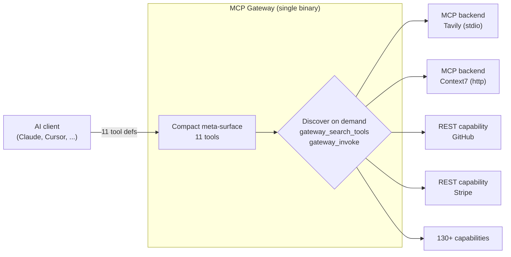
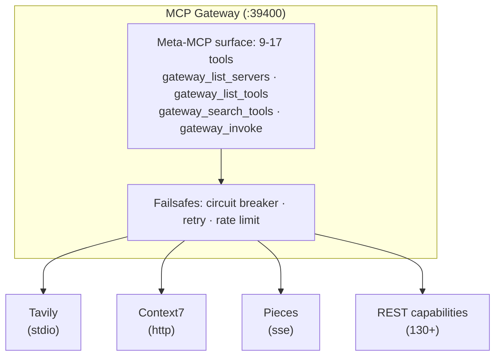

# MCP Gateway

[](https://github.com/MikkoParkkola/mcp-gateway/actions/workflows/ci.yml)
[](https://crates.io/crates/mcp-gateway)
[](https://crates.io/crates/mcp-gateway)
[](https://www.rust-lang.org)
[](https://github.com/MikkoParkkola/mcp-gateway/blob/main/LICENSES.md)
[](https://github.com/rust-secure-code/safety-dance/)
[](https://deps.rs/repo/github/MikkoParkkola/mcp-gateway)
[](https://github.com/MikkoParkkola/mcp-gateway/tree/main/capabilities)
[](https://modelcontextprotocol.io)
[](docs/OWASP_AGENTIC_AI_COMPLIANCE.md)
[](https://glama.ai/mcp/servers/MikkoParkkola/mcp-gateway)
[](https://glama.ai/mcp/servers/MikkoParkkola/mcp-gateway)
[](https://insiders.vscode.dev/redirect/mcp/install?name=mcp-gateway&config=%7B%22command%22%3A%22mcp-gateway%22%2C%22args%22%3A%5B%22serve%22%2C%22--stdio%22%5D%7D)
[](cursor://anysphere.cursor-deeplink/mcp/install?name=mcp-gateway&config=%7B%22command%22%3A%22mcp-gateway%22%2C%22args%22%3A%5B%22serve%22%2C%22--stdio%22%5D%7D)

**Unlimited MCP servers, tools and APIs. One fixed context cost.**

Plug every tool you own into Claude, Cursor, Codex or any MCP client. MCP Gateway is a single Rust binary that sits between an AI client and all of its tools. Connect any number of MCP servers and REST APIs behind it, and the agent sees only a compact meta-surface of 11 tools by default instead of hundreds of tool definitions. It discovers and calls the right backend tool on demand, and never drowns in tool definitions. 130+ REST API capabilities ship built in, and one command imports the servers you already have. On a 100-tool stack that is about 1,100 tokens of tool definitions per request instead of about 15,000, as modeled in the README [benchmark](docs/BENCHMARKS.md), and the answer to "how many tools can I connect" becomes "unlimited."


Personal and noncommercial use is free, including running the full gateway. Running it commercially needs a [commercial license](#license). From 4.0 the whole gateway is PolyForm Noncommercial; MIT grants on earlier 3.x releases are unchanged.

## The problem this removes

Every MCP tool an AI client connects costs roughly 150 tokens of context overhead<sup>[1](#fn-per-tool)</sup>, loaded into every request whether the tool gets used or not. Connect 20 servers with 100 tools between them and you spend about 15,000 tokens before the conversation starts. Context limits then force a second cost: you have to decide up front which tools to connect and leave the rest out, so the agent makes worse decisions because it cannot reach data you chose not to load.

MCP Gateway removes both costs. The agent loads a small fixed set of meta-tools, searches the full catalog with `gateway_search_tools`, and invokes any backend tool with `gateway_invoke` only when it needs it.


```mermaid
flowchart LR
    AI["AI client<br/>(Claude, Cursor, ...)"]
    subgraph GW["MCP Gateway (single binary)"]
        META["Compact meta-surface<br/>11 tools"]
        DISC{"Discover on demand<br/>gateway_search_tools<br/>gateway_invoke"}
    end
    T1["MCP backend<br/>Tavily (stdio)"]
    T2["MCP backend<br/>Context7 (http)"]
    C1["REST capability<br/>GitHub"]
    C2["REST capability<br/>Stripe"]
    Cn["130+ capabilities"]

    AI -->|"11 tool defs"| META
    META --> DISC
    DISC --> T1
    DISC --> T2
    DISC --> C1
    DISC --> C2
    DISC --> Cn
```

<a id="fn-per-tool"></a><sub>1. Per-tool and per-meta-tool token figures are modeled from [`benchmarks/public_claims.json`](benchmarks/public_claims.json) (~150 and ~100), not measured; a client that loads definitions only when needed pays less. 11 is the default HTTP setup as an administrator sees it; an ordinary client sees fewer. What a whole task costs is in the [FAQ](#faq).</sub>

## Quick Start

Until 4.0.0 is released, these commands install the current 3.x release; to try 4.0 now, see [What's new in 4.0](#whats-new-in-40).

**Four commands:**

```bash
brew trust --tap MikkoParkkola/tap   # Homebrew 6.0+
brew install MikkoParkkola/tap/mcp-gateway   # 1. install
mcp-gateway setup wizard --configure-client  # 2. import existing servers + wire up clients
mcp-gateway serve                            # 3. run
mcp-gateway doctor                           # 4. verify everything is healthy
```

That is it. Your AI clients now talk to the gateway, and the gateway routes to every backend you already had configured, at a flat `11 tools` instead of `~150` (4.0; 3.x shows about 15). Start with `gateway_search_tools` from your AI client to find any backend tool, then invoke it with `gateway_invoke`.

> **Nothing to import yet?** `mcp-gateway init` writes a working `gateway.yaml` with public capabilities so you can confirm the gateway is alive before adding your own servers.

**Or tell your AI assistant** (recommended):

> Read https://github.com/MikkoParkkola/mcp-gateway and install mcp-gateway to consolidate all my MCP servers behind one gateway

Your agent will install the binary, run the setup wizard, import your existing MCP servers, and wire itself up. It is written for any agent with terminal access, such as Claude Code, Cursor, Windsurf or Codex; which clients have a recorded 4.0 run is in [Supported clients](docs/CLIENTS.md).

## What's new in 4.0

4.0 adds a trust layer on top of the same fixed-context gateway. It is in beta (`4.0.0-beta.3`): pin it with `cargo install mcp-gateway --version 4.0.0-beta.3`, and read [docs/UPGRADING-4.0.md](docs/UPGRADING-4.0.md) first, because a 3.x config that 4.0 no longer trusts refuses to start.

- **The newest MCP revision, with a built-in version bridge.** MCP 2026-07-28 is on by default beside 2025-11-25 and earlier, on the same endpoint, and clients and backends on different revisions make ordinary tool calls to each other. Move your clients to 2026-07-28 before every server does.
- **Each caller sees and reaches only what it was granted.** Tool lists, search, server lists and the direct per-backend route show a caller only the backends and tools its key or identity may invoke.
- **Admins from your identity provider.** Map an SSO group or user to gateway admin; remove the rule and admin is gone on the next request.
- **An audit log you cannot switch off.** With auth on, every tool call is recorded with who made it and how it ended, refused calls included.
- **A config that fails closed.** Unknown keys, config files other users can read and plain HTTP with auth on a network address (unless you declare how it is protected) stop the start instead of running on settings the gateway does not trust.

Full list, limits and evidence: [What's new in 4.0](docs/whats-new-4.0.md).

## Install and set up

### Install

| Method | Command |
|--------|---------|
| **Homebrew (macOS/Linux, recommended)** | `brew install MikkoParkkola/tap/mcp-gateway` |
| **Cargo** | `cargo install mcp-gateway` |
| **cargo-binstall** | `cargo binstall mcp-gateway` |
| **Direct binary download (Windows x64)** | Download `mcp-gateway-windows-x86_64.exe` from the [latest release](https://github.com/MikkoParkkola/mcp-gateway/releases/latest) |
| **Docker** | `docker run -p 127.0.0.1:39400:39400 -e MCP_GATEWAY_SERVER__ALLOW_UNAUTHENTICATED_NETWORK_BIND=true -e MCP_GATEWAY_SERVER__CLEARTEXT_HTTP=host_local_publish -v $(pwd)/gateway.container.yaml:/config.yaml:ro ghcr.io/mikkoparkkola/mcp-gateway:latest --config /config.yaml --host 0.0.0.0 --port 39400` |
| **Docker, `npx`/`uvx` backends** | Same, with `:latest-full` — the default image carries no Node or `uv`, so a stdio backend that shells out to either cannot spawn. See [Docker Deployment](docs/DEPLOYMENT.md#docker-deployment). |

Release images are signed with keyless cosign. To check one, use cosign 2.6.5 or later on the 2.x
line, or 3.1.3 or later on 3.x; earlier versions accept signatures they should refuse (GHSA-fx35-mq7g-6g98, GHSA-whqx-f9j3-ch6m).
The command is in [RELEASING.md](RELEASING.md).

On Linux, the image runs as UID/GID 1001. Make an owner-only deployment copy
instead of changing ownership on your working config: `install -m 600
gateway.yaml gateway.container.yaml && sudo chown 1001:1001
gateway.container.yaml`. Do not make a credential-bearing config
world-readable. Docker Desktop handles bind-mount identity differently on
macOS and Windows.

<details>
<summary>Direct binary download</summary>

```bash
# macOS Apple Silicon
curl -L https://github.com/MikkoParkkola/mcp-gateway/releases/latest/download/mcp-gateway-darwin-arm64 -o mcp-gateway && chmod +x mcp-gateway

# macOS Intel
curl -L https://github.com/MikkoParkkola/mcp-gateway/releases/latest/download/mcp-gateway-darwin-x86_64 -o mcp-gateway && chmod +x mcp-gateway

# Linux x86_64
curl -L https://github.com/MikkoParkkola/mcp-gateway/releases/latest/download/mcp-gateway-linux-x86_64 -o mcp-gateway && chmod +x mcp-gateway
```

Every release binary ships with an SPDX SBOM (`<binary>.spdx.json`) and a keyless
[cosign](https://docs.sigstore.dev/cosign/) signature bundle (`<binary>.sigstore.json`),
signed by the release workflow at the release tag. Verify a download before running it
(replace `v4.0.0` with the release you downloaded). Use cosign 2.6.5 or later; earlier
versions accept signatures they should refuse (GHSA-fx35-mq7g-6g98, GHSA-whqx-f9j3-ch6m):

```bash
curl -LO https://github.com/MikkoParkkola/mcp-gateway/releases/download/v4.0.0/mcp-gateway-linux-x86_64.sigstore.json
cosign verify-blob \
  --bundle mcp-gateway-linux-x86_64.sigstore.json \
  --certificate-identity "https://github.com/MikkoParkkola/mcp-gateway/.github/workflows/release.yml@refs/tags/v4.0.0" \
  --certificate-oidc-issuer https://token.actions.githubusercontent.com \
  mcp-gateway
```

```powershell
# Windows x64 (PowerShell)
Invoke-WebRequest -Uri https://github.com/MikkoParkkola/mcp-gateway/releases/latest/download/mcp-gateway-windows-x86_64.exe -OutFile mcp-gateway.exe
```

</details>

### Set up, three ways

#### Option A: auto-import everything (recommended)

```bash
mcp-gateway setup wizard --configure-client
```

Scans Claude Desktop, Claude Code, Cursor, Zed, Continue.dev, Codex, and running MCP processes; lets you pick which servers to import into `gateway.yaml`; previews the gateway entry; writes it into each detected client config; verifies the write; and prints backup and rollback paths when an existing client config changes. Add `--yes` to skip the prompts and import everything.

#### Option B: add servers from the built-in registry

35 popular MCP servers are pre-registered with the right command, args, and env-var template. `mcp-gateway add` is compatible with `claude mcp add` and `codex mcp add`:

```bash
mcp-gateway list --available                                 # browse the library: login, on/off
mcp-gateway add tavily                                       # known server, writes ${TAVILY_API_KEY}
mcp-gateway add notion                                       # hosted server, logs in with OAuth
mcp-gateway add my-server -- npx -y @some/mcp-server --flag  # arbitrary stdio command
mcp-gateway add --url https://mcp.example.com/mcp my-server  # HTTP server
mcp-gateway add -e API_KEY=xxx my-server -- npx my-mcp-server
```

The registry is a library. `mcp-gateway init` turns on the servers that need no account (memory,
sequential-thinking, context7, time); every other server is off until you `add` it:

- A server that needs a key gets `${VAR}` references in `gateway.yaml`. If a variable is not set (in
  the environment or an `env_files` entry), `add` writes the server disabled and names the variable;
  set it, then set `enabled: true`.
- A vendor-hosted server that logs in with OAuth (Notion, Atlassian, Linear, Sentry, ...) opens the
  login in your browser the first time it is used. A server that takes a token in a header (GitHub,
  Stripe) gets the header with a `${VAR}` reference.
- Playwright, Chrome DevTools and fetch are added **disabled**. They can open any address they are
  given, so a prompt injection in a page or a tool result can steer them to your local network or a
  cloud metadata address, and the gateway's private-network guard covers REST capabilities only, not
  these servers. Git is added disabled too: without `--repository <path>` it acts on any repository
  a call names. Set `enabled: true` on one if you accept that. Both browsers start with a
  throwaway profile (`--isolated`); do not point them at your everyday browser profile.

`mcp-gateway list` shows what is configured. `mcp-gateway remove <name>` removes one.

#### Option C: hand-write `gateway.yaml`

For the full schema, see the annotated [examples/gateway-full.yaml](examples/gateway-full.yaml), which covers `env_files`, `server`, `auth`, `meta_mcp`, `streaming`, `failsafe`, `cache`, `capabilities`, and `backends`. The remaining top-level sections (`playbooks`, `security`, `webhooks`, `routing_profiles`, `code_mode`, `mtls`, `key_server`, `agent_auth`, `runtime`, `control_plane`, `cost_governance`) have no prose reference yet; the `Config` struct in [src/config/mod.rs](src/config/mod.rs) is the authoritative list. Minimal example:

```yaml
server:
  port: 39400

meta_mcp:
  enabled: true

backends:
  tavily:
    # `command` is parsed with host-platform rules: POSIX shlex on unix,
    # CommandLineToArgvW on Windows (so `C:\Windows\py.exe …` keeps its
    # backslashes; quote paths that contain spaces).
    command: "npx -y tavily-mcp@0.2.22"
    description: "Web search"
    env:
      TAVILY_API_KEY: "${TAVILY_API_KEY}"

  sentry:
    http_url: "https://mcp.sentry.dev/mcp"
    description: "Sentry issues"

  realtime:
    # WebSocket backend: headers ride the upgrade request once (UPGRADING-4.0 §47).
    ws_url: "wss://rt.example.com/mcp"
    headers:
      Authorization: "Bearer ${RT_TOKEN}"
```

### Run and verify

```bash
mcp-gateway serve                  # start the gateway
mcp-gateway doctor                 # diagnose config, port, env vars, backend health
mcp-gateway doctor --fix           # auto-fix issues where possible
```

The web dashboard is at <http://localhost:39400/ui> once `serve` is running. The
operator dashboard at `/dashboard` needs the admin credential, and a browser
cannot send one on a navigation — so `serve` prints a single-use link to open it
with, on a loopback bind. A network-bound gateway prints none and is managed
through `/ui` with the token instead. See
[Opening the dashboard](docs/DEPLOYMENT.md#opening-the-dashboard).

### Connect AI clients (if you skipped Option A)

`setup export` writes the gateway entry into client config files for you. It auto-detects the right path per client:

```bash
mcp-gateway setup export --target all --dry-run       # preview without writing
mcp-gateway setup export --target all                 # write, back up, verify
mcp-gateway setup export --target claude-code         # one client
mcp-gateway setup export --target all --watch         # regenerate on gateway.yaml changes
mcp-gateway setup export --rollback <backup-file>     # restore one client config
```

Existing client files are backed up before mutation. The command prints the exact rollback command beside each updated client.

Targets: `claude-code`, `claude-desktop`, `cursor`, `vs-code-copilot`, `windsurf`, `cline`, `zed`, `generic`, `all`. The file each one writes, and which clients have been verified against 4.0, are in [Supported clients](docs/CLIENTS.md).

Modes: `--mode proxy` (HTTP), `--mode stdio` (subprocess), `--mode auto` (probe the health endpoint, then fall back).

<details>
<summary>Manual JSON snippet (if you prefer to edit by hand)</summary>

```json
{
  "mcpServers": {
    "gateway": {
      "type": "http",
      "url": "http://localhost:39400/mcp"
    }
  }
}
```

</details>

## Why use MCP Gateway?

- **A fixed, small context cost.** In the README benchmark, 100 backend tools cost about 1,100 tokens of tool definitions instead of 15,000, because the agent sees 11 meta-tools instead of every definition. Numbers are reproducible; see [Benchmarks](docs/BENCHMARKS.md).
- **Unlimited tools, discovered on demand.** No more choosing which servers fit the budget. The gateway sets no limit on backends or tools; the agent searches (`gateway_search_tools`) and invokes (`gateway_invoke`) tools as it needs them.
- **Add any REST API in minutes.** Drop in a YAML file or import an OpenAPI spec with `mcp-gateway cap import`. 130+ capabilities ship built in.
- **Per-user identity to backends.** Multitenant backends can receive the verified end-user identity with no gateway-stored long-lived credential. See [Multitenant identity](#end-user-identity-v31).
- **Secure by construction.** A tool-poisoning validator scans every backend tool description before it reaches the agent, optional SHA-256 pinning with rug-pull detection protects each pinned capability, and controls are mapped to all ten OWASP Agentic AI Top 10 risks in a self-assessment that also lists the remaining gaps. The crate sets `#![deny(unsafe_code)]`, so any unsafe block needs an explicit `#[allow]` opt-in, with optional mTLS, message signing, and agent identity.
- **Swap your MCP stack without losing your session.** Backends and capability YAMLs hot-reload while the AI stays connected. No restart, no lost context.
- **Production resilience.** Circuit breakers, retries with backoff, rate limiting, and health checks keep one flaky server from taking down the whole toolchain.
- **Dual protocol.** MCP plus outbound A2A (agent-to-agent): an MCP client can delegate work to an agent that speaks only A2A 1.0, and the delegation passes the same policy, budget, audit and firewall checks as a tool call. The gateway does not serve A2A itself.

### What MCP Gateway is, and what it is not

MCP Gateway is a tool and capability **router**. It routes MCP tool, resource, and prompt traffic to backend MCP servers and to capability-backed REST APIs, and it can proxy MCP server-to-client requests like `sampling/createMessage`, `elicitation/create`, and `roots/list` back to the connected client over the existing session.

It is not a chat-completions or embeddings proxy. When a backend asks for `sampling/createMessage`, the connected client performs the model call, not the gateway. The OpenAI-compatible prompt-cache helpers exist for one narrow reason: so `gateway_invoke` can preserve `prompt_cache_key` behavior for backends that call LLM APIs internally. That boundary is deliberate. The value here is routing hundreds of tools through a small surface, not sitting in the model path.

Compared with a client that loads every tool definition into every request, the gateway trades a one-time discovery hop for a flat, small context cost. It aggregates many backends behind one namespaced surface with integrity checks, ranking, and per-user identity.

### MCP compatibility

The gateway speaks MCP 2026-07-28 (stateless, on by default) and 2025-11-25, 2025-06-18, 2025-03-26 and 2024-11-05 (through the `initialize` handshake). It negotiates the revision with the client and with each backend on its own, so a client and a backend on different revisions still work together:

- **Ordinary calls** work across legacy and 2026 clients and backends. An HTTP or stdio backend that rejects the gateway's proposed revision is retried at the highest revision both sides speak. A 2026-only backend that refuses the `initialize` handshake must be reached over HTTP.
- **A 2026 backend's mid-call questions reach an older client.** The gateway relays them as the `elicitation/create`, `sampling/createMessage` or `roots/list` requests the client already understands, collects the answers, and retries the backend. A 2026 client gets the same questions as a continuation it answers by retrying (over HTTP it needs a verified caller identity).

Limits: the reverse translation is not implemented, so an older backend that sends its own mid-call request is not relayed to any client. A legacy client is refused the 2026-only tasks methods (`-32601`) rather than given an emulation, and the bridge relays only those three request types and refuses the rest. The relay runs only on calls the gateway dispatches itself (`gateway_invoke` and the other meta-tool invoke paths), not on the direct `POST /mcp/{name}` route, and only for request types the client declared in `initialize`. The per-pairing matrix, with the test behind each row, is in [docs/PROTOCOL_COMPATIBILITY.md](docs/PROTOCOL_COMPATIBILITY.md).

<a id="end-user-identity-v31"></a>

## Multitenant identity

A multitenant backend (email, memory, calendar) that runs its own OIDC normally sees only "the gateway," so it cannot enforce per-user access or produce a per-user audit trail. mcp-gateway propagates the verified end-user identity to the backend through one of three configured strategies. It can mint a short-lived gateway-signed assertion, forward the caller's own token, or run an RFC 8693 token exchange for OAuth-native backends. It keeps no long-lived credential for anyone. A backend marked `required` fails closed rather than serve a shared key when no verified identity is present, and per-user results stay isolated in the cache. See [ADR-007](docs/adr/ADR-007-identity-propagation.md), [ADR-008](docs/adr/ADR-008-multi-user-oauth-isolation.md), and [docs/UPGRADING-3.0.md](docs/UPGRADING-3.0.md). For the full propagation sequence, each strategy's wiring, the safety invariants, and the 2.x upgrade path, see [What is new in v3.1.0: end-user identity to backends](docs/whats-new-v3.1-identity.md).

### Where the numbers come from

Quantitative claims in this README are sourced from [docs/BENCHMARKS.md](docs/BENCHMARKS.md) and the machine-readable [benchmarks/public_claims.json](benchmarks/public_claims.json), with a CI check that fails on drift. The public Trust Fabric plan is tracked in [docs/roadmap/trust-fabric.md](docs/roadmap/trust-fabric.md).

## Why the token math matters

In a client that loads every definition up front, every MCP tool you connect costs context in every request; this README models it at about 150 tokens per tool, an assumed figure rather than a measurement. Connect 20 servers with 100 tools and you have burned roughly 15,000 tokens before the first message, on definitions the AI probably will not use this turn. A client that loads only tool names until one is needed pays far less, so the comparison below is for eager clients. Worse, in an eager client context limits force you to choose which tools to connect at all, so the agent makes weaker decisions because the right data is out of reach.

| | Without gateway | With gateway |
|---|----------------|--------------|
| **Tools in context** | Every definition, every request (eager client) | 11 meta-tools in the README benchmark (~1,100 tokens) |
| **Schema footprint** | ~15,000 modeled tokens (100 tools) | ~1,100 modeled tokens before discovery; not completed-task cost |
| **Measured task cost** | Direct path was lower at every tested size | Meta path used 1.2–16.1% more input tokens and one extra turn |
| **Practical tool limit** | 20 to 50 tools under context pressure | None set by the gateway; tools are discovered on demand |
| **Connect a new REST API** | Build an MCP server (days) | Drop a YAML file or import an OpenAPI spec (minutes) |
| **Changing MCP config** | Restart the AI session, lose context | Capability YAMLs and backends reload live; most other config fields need a gateway restart, which drops open sessions |
| **When one tool breaks** | Cascading failures | Circuit breakers isolate it |

The gateway exposes 9 tools minimum, 11 in the README benchmark scenario, counted for an administrator; a caller without admin standing is shown five fewer, six where the stats tool is exposed, because it is only shown what it could invoke. The base discovery quartet stays fixed. Everything else is listed only where it can answer: stats, cost reporting, playbooks and profile control appear once the configuration that backs them exists, and webhook status where a webhook registry is attached, which the stdio transport never has. A deployment that turns all of them on is served 17. It costs context exactly where it is useful.

## Meta-tools

These are the gateway's own tools, defined in `src/gateway/meta_mcp_tool_defs.rs`. Backend tools are not listed here; the agent finds them with `gateway_search_tools` and calls them with `gateway_invoke`. "Admin only" tools are hidden from, and refused to, a caller without admin standing.

| Tool | What it does | Listed when |
|---|---|---|
| `gateway_list_servers` | Lists connected backends with status, tool count and circuit-breaker state | Always |
| `gateway_list_tools` | Lists tools from one backend, or from all of them | Always |
| `gateway_search_tools` | Searches every backend tool by keyword and returns ranked matches | Always |
| `gateway_invoke` | Calls a backend tool through the gateway's auth, rate-limit, cache and failsafe layers | Always |
| `gateway_kill_server` | Stops routing to a backend at once (operator kill switch) | Always; admin only |
| `gateway_revive_server` | Restores routing to a stopped backend and resets its error budget | Always; admin only |
| `gateway_list_disabled_capabilities` | Lists capabilities suspended for a high error rate, and for how long | Always |
| `gateway_set_state` | Moves the session to a workflow state, which controls which state-scoped capabilities are listed | Always; needs a session, so a 2026-07-28 connection is refused |
| `gateway_reload_capabilities` | Re-reads capability YAML files from disk without a restart | Always; admin only |
| `gateway_reload_config` | Reloads the config file from disk without a restart | The gateway was started from a config file; admin only |
| `gateway_webhook_status` | Lists webhook endpoints with received, delivered and failed counts | HTTP transport with `webhooks.enabled` (on by default); never over stdio; admin only |
| `gateway_get_stats` | Reports usage statistics: invocations, cache hits, top tools | `meta_mcp.expose_stats_tool: true`; admin only |
| `gateway_cost_report` | Reports session and API-key spend by backend and tool | `cost_governance.enabled: true` |
| `gateway_run_playbook` | Runs a multi-step playbook as one call | `playbooks.enabled: true` and at least one playbook loaded |
| `gateway_list_profiles` | Lists the configured routing profiles | At least one entry under `routing_profiles` |
| `gateway_get_profile` | Shows the active routing profile | At least one entry under `routing_profiles` |
| `gateway_set_profile` | Switches the session's routing profile, which narrows the tools and backends available | At least one entry under `routing_profiles`; needs a session, so a 2026-07-28 connection is refused |

The first nine rows are the minimum. The default HTTP deployment, started from a config file, adds `gateway_reload_config` and `gateway_webhook_status`. `meta_mcp.exposed_meta_tools` narrows any of these to an allow-list, including the rows marked "Always". Code Mode, below, replaces the whole set with two tools.

### Code Mode: two tools instead of the meta-tool set

Setting `code_mode.enabled: true` makes `tools/list` return exactly two tools, `gateway_search` and `gateway_execute`, instead of the meta-tool set. Everything else is reached through those two. Tools named in `meta_mcp.surfaced_tools` are not appended in this mode, so the count stays at two however many backends are connected. Code Mode is off by default. `gateway_search` returns L0 by default (tool name, one-line purpose, score). Pass `detail=l1` or `detail=l2` for more, or `explain=true` for ranking diagnostics. `include_schema=true` is deprecated and maps to L2.

```yaml
code_mode:
  enabled: true
```

The [Code Mode guide](docs/CODE_MODE.md) walks through a session and the errors you can get back.


## Security

Connecting N MCP servers to an agent means accepting N attack surfaces. Tool poisoning, rug pulls, and exfiltration through hidden instructions in tool descriptions are demonstrated attacks, not hypotheticals. Invariant Labs' writeup ([MCP Security Notification: Tool Poisoning Attacks](https://invariantlabs.ai/blog/mcp-security-notification-tool-poisoning-attacks)) and Simon Willison's summary ([MCP has prompt injection security problems](https://simonwillison.net/2025/Apr/9/mcp-prompt-injection/)) lay out the threat model.

mcp-gateway puts every backend tool description behind one audit surface and defends it structurally:

- **Tool-poisoning validator.** Every backend tool description is scanned before it reaches the agent's context window. HIGH patterns fail closed: `<IMPORTANT>` blocks, `~/.ssh`/`~/.aws`/`id_rsa`/`.env`/`/etc/passwd`, `sidenote` exfiltration language, `curl .* https?://`, and `base64` in an exfil context. MEDIUM patterns warn: 40+ consecutive spaces, zero-width or bidi-override Unicode, and oversized descriptions. Implementation: [`src/validator/rules/tool_poisoning.rs`](src/validator/rules/tool_poisoning.rs) (19 tests).
- **Optional SHA-256 capability hash-pinning.** `mcp-gateway cap pin <file>` writes a `sha256:` line over the file's canonical hash (`sed 's/\r$//' capability.yaml | grep -v '^sha256:' | sha256sum` reproduces it from any shell; CRLF line endings hash as LF). Unpinned files still load. A pinned file that no longer matches fails closed on load and on every watcher event.
- **Rug-pull detection.** When a pinned capability's on-disk content changes after approval, the watcher unloads it and logs `RUG-PULL DETECTED`. The capability stays quarantined until an operator re-pins it. Implementation: [`src/capability/hash.rs`](src/capability/hash.rs) and `detect_rug_pulls` in [`src/capability/backend.rs`](src/capability/backend.rs).
- **Centralized audit surface.** Capability YAMLs are plain text: diffable, greppable, and reviewable in a PR. The agent only ever sees the compact meta-surface, so there is no N-server tool-list pollution and no N-server attack surface.

Full walkthrough, PoC snippets, and roadmap: [docs/blog/security-aware-mcp-gateway.md](docs/blog/security-aware-mcp-gateway.md).

- **OWASP Agentic AI Top 10 (self-assessed).** Controls are mapped across all 10 ASI risks at the gateway boundary in-tree. That is not a certification. Hardening follow-ups are tracked separately for SBOMs, release signing, live remote attestation discovery, multi-gateway signing, SQL-sink defaults, and collusion detection. See [docs/OWASP_AGENTIC_AI_COMPLIANCE.md](docs/OWASP_AGENTIC_AI_COMPLIANCE.md).

### Recent additions

- **OpenAPI importer.** `mcp-gateway cap import <spec-url-or-file>` turns an OpenAPI 3 spec into one validated capability YAML per operation. The full Swagger Petstore spec becomes 19 validated capability YAMLs end to end:
  ```bash
  mcp-gateway cap import https://petstore3.swagger.io/api/v3/openapi.json --output capabilities/ --prefix petstore
  ```
  22 tests across [`src/capability/openapi.rs`](src/capability/openapi.rs) and [`tests/openapi_import_tests.rs`](tests/openapi_import_tests.rs).

## Architecture


```mermaid
flowchart TB
    subgraph GW["MCP Gateway (:39400)"]
        META["Meta-MCP surface: 9-17 tools<br/>gateway_list_servers · gateway_list_tools<br/>gateway_search_tools · gateway_invoke"]
        FS["Failsafes: circuit breaker · retry · rate limit"]
        META --> FS
    end
    FS --> B1["Tavily<br/>(stdio)"]
    FS --> B2["Context7<br/>(http)"]
    FS --> B3["Pieces<br/>(sse)"]
    FS --> B4["REST capabilities<br/>(130+)"]
```

Single-binary gateway. An AI client talks to the compact meta-surface, and the gateway dynamically discovers and routes to backend tools. Key modules: `gateway/` (core router, OAuth, streaming, UI), `provider/` (MCP/composite/capability), `capability/` (discovery, validation), `transport/` (HTTP, stdio), `security/` (firewall, mTLS, message signing, agent identity, memory scanner), `identity_propagation/`, `key_server/`, `cost_accounting/`, `scheduler/`, `skills/`, `tool_profiles/`, `config_reload/`, and `a2a/` (outbound A2A bridge).

## Features

### Web dashboard

Embedded web UI at `/ui`: live status, searchable tools, server health, a read-only control-plane view, and a config viewer. Operator dashboard at `/dashboard`, which needs the admin credential — on a loopback bind `serve` prints a single-use link to open it with, since a browser cannot attach an `Authorization` header to a navigation. Cost tracking at `/ui#costs`. All served from the same binary and port, with no frontend build step.

### Security and governance

| Feature | Description | Docs |
|---------|-------------|------|
| **Authentication** | Bearer tokens, API keys, explicit admin keys, per-client rate limits, and opt-in per-client circuit breakers. With auth disabled every caller over HTTP is anonymous and holds no admin; a stdio caller is admin, because the client spawned the process | [examples/per-client-tool-scopes.yaml](examples/per-client-tool-scopes.yaml) |
| **Cross-site protection** | `Origin`, `Host` and `Sec-Fetch-Site` validation refuses web pages reaching the local port. A client that sends no `Origin` is not refused for that, but the `Host` check applies to every request, so a client reaching the gateway by a name it does not answer to is refused whether or not it is a browser | [docs/DEPLOYMENT.md](docs/DEPLOYMENT.md#browser-access-to-the-gateway-port) |
| **End-user identity propagation** | Three configured strategies (`identity_propagation` config): gateway-signed assertion, client-token passthrough, and RFC 8693 token exchange. Fails closed when a backend requires identity. Per-user cache isolation. Enforced on dispatch, Code Mode, and direct routes. | [docs/adr/ADR-007-identity-propagation.md](docs/adr/ADR-007-identity-propagation.md) |
| **Per-user OAuth isolation** | Fail-closed default (v3.0): a backend that requires a per-user OAuth identity refuses a call that lacks one instead of serving a shared stored token. Opt into the previous shared-credential behavior with `auth.single_user: true` (personal gateway) or `oauth.shared_account: true` (a specific backend). Upgrading from 2.x backs up `gateway.yaml` and prints a one-time posture notice; no config changes automatically. | [docs/adr/ADR-008-multi-user-oauth-isolation.md](docs/adr/ADR-008-multi-user-oauth-isolation.md), [docs/UPGRADING-3.0.md](docs/UPGRADING-3.0.md) |
| **Cleartext credential refusal** | A backend whose configuration is credential-bearing — an `oauth` section, identity propagation, injected secrets, any static header whatever its name, or userinfo or a query in the URL — over plain `http://` to a host off this machine is refused at config load rather than started. Loopback is exempt; `allow_cleartext_credentials: true` on that backend accepts the exposure knowingly | [docs/REMOTE_BACKENDS.md](docs/REMOTE_BACKENDS.md#authenticated-remote-backends) |
| **Per-client tool scopes** | Allowlist or denylist tools per API key with glob patterns | [examples/per-client-tool-scopes.yaml](examples/per-client-tool-scopes.yaml) |
| **Security firewall** | Credential redaction, prompt-injection detection, and shell/SQL/path-traversal scanning | [CHANGELOG](CHANGELOG.md#260---2026-03-13) |
| **Cost governance** | Per-tool, per-key, daily budgets with alert thresholds (log/notify/block) | [CHANGELOG](CHANGELOG.md#260---2026-03-13) |
| **mTLS** | Certificate-based auth for tool execution | [CHANGELOG](CHANGELOG.md#240---2026-02-25) |

### Integration and discovery

The gateway ships with **130+ built-in capabilities**: weather, Wikipedia, GitHub, stock quotes, package tracking, and more. Capability YAMLs hot-reload automatically after file changes, no restart needed.

| Feature | Description |
|---------|-------------|
| **Capability system** | REST API to MCP tool via YAML. Hot-reloaded. [130+ built-in](capabilities/). OpenAPI import supported. |
| **Transform chains** | Namespace, filter, rename, and response transforms. [Example](examples/transform-example.yaml). |
| **Webhooks** | GitHub/Linear/Stripe push events as MCP notifications. [Docs](docs/WEBHOOKS.md). |
| **Auto-discovery** | Discover MCP servers from existing client configs and running processes. |
| **Surfaced tools** | Pin high-value tools directly in `tools/list` for one-hop invocation. |
| **Semantic search** | TF-IDF ranked search across all tool names and descriptions. |
| **Tool profiles** | Usage analytics per tool: latency, errors, trends. Persisted to disk. |
| **Config export** | Export sanitized config as YAML or JSON via `mcp-gateway config export`. |

### Protocol and transport

- **MCP versions**: 2025-11-25 and earlier through the `initialize` handshake, and 2026-07-28 without one (see [What's new in 4.0](#whats-new-in-40)). The handshake negotiates up to 2025-11-25 only, because 2026-07-28 removed it. The 2026-07-28 revision is served on the stateless `POST /mcp` path, where a client names it per request with the `MCP-Protocol-Version` header; it is on by default and switched off with `server.modern_protocol: false`. On stdio, `server/discover` also lists 2026-07-28 while `server.modern_protocol` is on, and a stdio request that declares its capabilities in its own 2026-style `_meta` gets a 2026 continuation when its backend asks for input mid-call. How mixed client and backend revisions interoperate: [MCP compatibility](#mcp-compatibility)
- **Backend transports**: stdio, HTTP (Streamable HTTP or SSE), WebSocket (`ws_url`, legacy `initialize` handshake, one shared socket per backend), and A2A (`a2a_url`; A2A 1.0 JSON-RPC agents only, so an agent offering only 0.3 is refused at start; one `send_message` tool per agent; `a2a` feature, on by default)
- **Client transports**: clients connect via stdio or HTTP (`POST /mcp`); there is no inbound WebSocket listener
- **Hot reload**: capability YAMLs and backends are watched and reloaded live. `server.public_url` and `control_plane.role_mapping` are re-read per request; everything else needs a restart
- **Reload outcomes**: `gateway_reload_config` and `/ui/api/reload` report `restart_required`, and keep reporting it until a restart, for every field a reload cannot apply — which is every field outside that short live list, `auth` included. A reload that would leave the tool endpoint reachable without a credential is refused rather than applied
- **Config discovery**: auto-finds `gateway.yaml` in cwd, `~/.config/mcp-gateway/`, and `/etc/mcp-gateway/`
- **"Did you mean?"**: Levenshtein-based typo correction on tool names
- **Tool annotations**: MCP 2025-11-25 `title`, `readOnlyHint`, `destructiveHint`, `idempotentHint`, `openWorldHint`; gateway meta-tools are fully annotated, while backend tools use the hybrid pass-through/fill policy in [ADR-003](docs/adr/ADR-003-mcp-tool-annotation-policy.md)
- **Dynamic descriptions**: live tool and server counts in meta-tool descriptions
- **Shell completions**: `mcp-gateway completions bash|zsh|fish`
- **Spec preview** (opt-in): filtered `tools/list` (SEP-1821), `tools/resolve` (SEP-1862), dynamic promotion

### Supported backends

Any MCP-compliant server works. All three transport types are supported:

| Transport | Examples |
|-----------|---------|
| **stdio** | `tavily-mcp@0.2.22`, `@modelcontextprotocol/server-filesystem`, `@playwright/mcp` |
| **HTTP** | Any Streamable HTTP server |
| **SSE** | Pieces, LangChain, [GitMCP](https://gitmcp.io) (free remote docs and code search for any GitHub repo) |

Remote MCP servers plug in by URL, with no extra code. See [examples/gateway-full.yaml](examples/gateway-full.yaml) for a commented GitMCP backend entry and [docs/REMOTE_BACKENDS.md](docs/REMOTE_BACKENDS.md) for a step-by-step walkthrough.

## API

| Endpoint | Method | Description |
|----------|--------|-------------|
| `/livez`, `/readyz` | GET | Liveness and readiness probes; never read backend health, public exactly when `/health` is. `/readyz` waits for the capability catalogue to load |
| `/health` | GET | Health check: `status` and `version`; authenticated admin callers also get per-backend status and runtime profile lifecycle state |
| `/mcp` | POST | Meta-MCP mode (dynamic discovery) |
| `/mcp/{backend}` | POST | Direct backend access; `tasks/*` is refused here (use `/mcp`) |
| `/ui` | GET | Web dashboard |
| `/ui/api/control-plane` | GET | Read-only local control-plane projection for inventory, runtime health, decisions, RBAC, and license boundaries |
| `/dashboard` | GET | Operator dashboard. Admin only; opened with the single-use link `serve` prints on a loopback bind |
| `/metrics` | GET | Prometheus metrics (with `--features metrics`); requires `Authorization: Bearer <server.metrics_token>`, the admin bearer is refused |

## Performance

| Metric | Value | Notes |
|--------|-------|-------|
| **Startup time** | ~8ms | Mean run time of `mcp-gateway --help` (`hyperfine`, 20 runs); not the time until the gateway serves requests ([benchmarks](docs/BENCHMARKS.md)) |
| **Binary size** | ~12-13 MB | Release build with LTO, stripped |
| **Hot-path microbenchmarks** | Included | Criterion suite covers registry, parsing, cache-key, firewall, and semantic-search hot paths |
| **End-to-end latency** | Backend-dependent | Measure with your real MCP servers and REST APIs rather than relying on a synthetic single number |

## SKILL.md / agentskills.io compatibility

MCP Gateway can ingest [Agent Skills](https://agentskills.io) and Claude Code `SKILL.md` files and expose them as discoverable skills alongside capability YAML. This lets the gateway consume any SKILL.md, whether authored locally, shipped from `agentskills.io`, or pulled from a GitHub release, and surface it through the same meta-tool surface used for capabilities.

```bash
# Import a local skill directory (auto-discovers SKILL.md + resources/)
mcp-gateway skills import ~/.claude/skills/gws-gmail-send

# Import a single SKILL.md file
mcp-gateway skills import ./path/to/SKILL.md

# Import from an agentskills.io URL
mcp-gateway skills import https://agentskills.io/skills/my-skill/SKILL.md

# List imported skills
mcp-gateway skills list

# Search by name, description, trigger, or keyword
mcp-gateway skills search "gmail"

# Show the full body (including any embedded code blocks)
mcp-gateway skills show gws-gmail-send

# Remove a skill
mcp-gateway skills remove gws-gmail-send
```

**What gets parsed**

- YAML frontmatter (`name`, `description`, `version`, `effort`, `allowed-tools`, `triggers`, `keywords`)
- Markdown body, with fenced `bash`/`python`/`json` code blocks extracted as structured `SkillCodeBlock` entries
- Progressive-disclosure resources: `SKILL.advanced.md`, `reference.md`, `README.md`, and any `resources/*.md` files in the skill directory

**Security model (read-only)**

Imported skills are stored as data, not executed. Embedded `bash` or `python` blocks are parsed and surfaced to users and agents via `skills show`, but MCP Gateway will never run them automatically. A future release may add opt-in execution gated on per-skill user consent. To run a skill's commands today, copy them from `skills show` and run them in your own shell.

Registry location: `~/.mcp-gateway/skills.json` (override with `MCP_GATEWAY_SKILLS_REGISTRY` or `--registry`).

Reference: [Anthropic SKILL.md spec](https://docs.claude.com/en/docs/claude-code/skills) and [agentskills.io](https://agentskills.io).

## FAQ

**What is MCP Gateway?**
A self-hosted gateway that puts many MCP servers and REST APIs behind one MCP endpoint and shows the AI client a compact set of tools for finding and calling them.

**Is it an MCP proxy or an MCP server aggregator?**
Both. It proxies MCP traffic to backend servers and aggregates their tools behind one endpoint.

**Which MCP protocol versions does it support?**
2026-07-28, 2025-11-25, 2025-06-18, 2025-03-26 and 2024-11-05. A client and a backend on different revisions can make ordinary tool calls through it; the limits of the bridge are in [MCP compatibility](#mcp-compatibility).

**Does it save tokens?**
It keeps backend tool definitions out of the client's tool list, so the context they take stays fixed. A small live-agent benchmark found no completed-task token saving, because of the extra search hop; see [Why the token math matters](#why-the-token-math-matters) and [Benchmarks](docs/BENCHMARKS.md).

**Which clients work with it?**
Claude Code has a recorded run against 4.0. The gateway speaks MCP over stdio and streamable HTTP, and `mcp-gateway setup export` writes config for seven named clients; which client versions have a recorded run is in [Supported clients](docs/CLIENTS.md).

**Is it free?**
Free for personal and noncommercial use under PolyForm Noncommercial 1.0.0. Commercial use needs a commercial license; see [License](#license).

## Documentation

| Document | Contents |
|----------|----------|
| [Quick Start](docs/QUICKSTART.md) | Zero to running in 2 minutes |
| [Annotated config example](examples/gateway-full.yaml) | Commented `gateway.yaml` covering the most-used config sections |
| [Code Mode](docs/CODE_MODE.md) | Two tools instead of the meta-tool set: turning it on, searching, executing, reading its errors |
| [OAuth Configuration](docs/OAUTH_CONFIG.md) | OAuth 2.0 setup with Slack and Figma examples |
| [Upgrading to 4.0](docs/UPGRADING-4.0.md) | Per-issuer OAuth storage, strict `env_files` parsing, protocol floor, and the single-license change |
| [Upgrading to 3.0](docs/UPGRADING-3.0.md) | Per-user OAuth isolation and identity-propagation upgrade path |
| [Deployment Guide](docs/DEPLOYMENT.md) | Docker, systemd, TLS/mTLS, scaling |
| [Multi-User Setup](docs/MULTI_USER.md) | Key server, policy scopes, per-backend identity propagation |
| [OpenAPI Import](docs/OPENAPI_IMPORT.md) | Generate capabilities from OpenAPI specs |
| [Webhooks](docs/WEBHOOKS.md) | Event integration setup |
| [Long-running calls](docs/TASKS.md) | Tasks, progress and cancellation |
| [Community Registry](docs/COMMUNITY_REGISTRY.md) | Share and install capabilities |
| [Benchmarks](docs/BENCHMARKS.md) | Performance measurements |
| [MCP compatibility](docs/PROTOCOL_COMPATIBILITY.md) | Client and backend revision pairings: what works, what is translated, what is refused |
| [Windows limits](CONTRIBUTING.md#windows-test-coverage) | Unix-only behaviors and what the Windows CI job runs |
| [Changelog](CHANGELOG.md) | Release history |
| [Security posture](docs/SECURITY_POSTURE.md) | What is on by default, what to turn on, and known limits |
| [OWASP Agentic AI Compliance](docs/OWASP_AGENTIC_AI_COMPLIANCE.md) | Risk coverage matrix |
| [ShadowRadar](docs/SHADOW_SCAN.md) | Passive local discovery and static network-rule export |

## Troubleshooting

**Backend will not connect?** Test the command directly (`npx -y tavily-mcp@0.2.22`), then check gateway logs with `--log-level debug`.

**Circuit breaker open?** Ask your MCP client for `gateway_list_servers`: it
reports `circuit_breaker` per backend and works on the shipped config. The HTTP
equivalent, `curl -H "Authorization: Bearer $ADMIN_KEY" localhost:39400/health |
jq '.backends'`, additionally needs `auth.enabled: true` and an admin
credential — authentication is off by default, and while it is off every caller
is anonymous, so the token is ignored and even a bearer-carrying request sees
just `{count, all_healthy}`. Adjust thresholds in `failsafe.circuit_breaker`
(default: opens after 5 consecutive failures, retries after 30s).

**One tool went quiet, then came back on its own about five minutes later?**
That is the per-capability error budget, not the circuit breaker — separate
mechanism, separate keys. A capability whose failure rate crosses
`error_budget.capability.threshold` is disabled on its own, leaving the rest of
its backend serving, and re-enables itself on the next call once
`error_budget.capability.cooldown` (default 5 minutes) has elapsed.
`gateway_list_disabled_capabilities` names the ones currently suspended.

**A whole backend went offline and stayed offline?** The backend-level error
budget auto-killed it: its failure rate crossed `error_budget.threshold` over
the sliding window. Unlike a capability, a killed backend does **not** come
back by itself — revive it with `gateway_revive_server`, and raise the
threshold or the window if the kill was premature. `gateway_list_servers`
reports a killed backend as `"status": "disabled"`, which is how you tell an
auto-kill apart from an open breaker.

Every key of both budgets is documented inline in `examples/gateway-full.yaml`
under `error_budget:`. Rate-limited responses (`429`, `RESOURCE_EXHAUSTED`) are
excluded from both budgets: a throttled backend is a working backend, so
throttling alone can neither kill a backend nor disable a capability. The same
holds for the gateway's own per-backend `failsafe.rate_limit`: its refusal reads
`Rate limit exceeded for backend '<name>'` and is never sampled.

**Tools not appearing?** Verify the backend is running (`gateway_list_servers`). Tool lists are cached for 5 minutes.

## Versioning and stability

This project follows [Semantic Versioning](https://semver.org/) over its
**product surface**: the CLI, and the configuration file format. Changes to
either are versioned accordingly — a config key that stops being accepted, or a
command that changes behaviour, is a breaking change.

**The Rust library API is not part of that surface.** Types are `pub` for
modularity and testing, not as a supported embedding API, and they may change
in any release. The crate ships a binary; at the time of writing crates.io
reports zero reverse dependencies. If you embed the library, pin an exact
version (`=4.0.0`) rather than a caret range.

This is stated explicitly because "removing a `pub` field" and "breaking a
supported API" are only the same thing when the API is supported. Here it is
not, and that needs to be published rather than assumed.

## Contributing

1. Fork and branch (`git checkout -b feature/your-feature`)
2. Test (`cargo test`) and lint (`cargo fmt && cargo clippy -- -D warnings`)
3. Open a PR against `main` with a clear description and a changelog fragment in `changelog.d/` (see [CONTRIBUTING](CONTRIBUTING.md))

See [CONTRIBUTING.md](CONTRIBUTING.md) for full details. Look for [`good first issue`](https://github.com/MikkoParkkola/mcp-gateway/labels/good%20first%20issue) or [`help wanted`](https://github.com/MikkoParkkola/mcp-gateway/labels/help%20wanted) to get started.

## Ecosystem

mcp-gateway is part of a suite of MCP tools:

| Tool | Description |
|------|-------------|
| **[mcp-gateway](https://github.com/MikkoParkkola/mcp-gateway)** | **Unlimited MCP servers, tools and REST APIs behind one MCP endpoint at a fixed context cost, with on-demand tool discovery and MCP revision bridging** |
| [trvl](https://github.com/MikkoParkkola/trvl) | AI travel agent, 36 MCP tools for flights, hotels, ground transport |
| [nab](https://github.com/MikkoParkkola/nab) | Web content extraction: fetch any URL with cookies and anti-bot bypass |
| [axterminator](https://github.com/MikkoParkkola/axterminator) | macOS GUI automation, 34 MCP tools via the Accessibility API |

## License

mcp-gateway is licensed under the **PolyForm Noncommercial License 1.0.0**
([LICENSE-NONCOMMERCIAL](LICENSE-NONCOMMERCIAL)). Every first-party file carries
a copyright line and an explicit
`// SPDX-License-Identifier: PolyForm-Noncommercial-1.0.0` header. There is no
second license and no allowlist.

What this means:

- **Personal and noncommercial use is free**, including running the whole gateway.
- **Running the gateway commercially requires a commercial license.** This covers
  the whole project — dispatch, transport, backend management, identity,
  security, governance — including the generic building blocks that earlier 3.x
  releases shipped under MIT headers. See [COMMERCIAL.md](COMMERCIAL.md).
- Rights granted in earlier releases are not revoked. Versions 3.0.0–3.2.1 were
  published with MIT package metadata, and v3.3.0 onward in the 3.x line shipped
  a small MIT core under per-file headers. Those copies stay MIT for their
  recipients; from **v4.0.0** there is no MIT core. See [NOTICE.md](NOTICE.md).

Full model: [LICENSES.md](LICENSES.md).

## Credits

Created by [Mikko Parkkola](https://github.com/MikkoParkkola). Implements [Model Context Protocol](https://modelcontextprotocol.io/) versions 2025-11-25 and 2026-07-28; the newer revision is served by default and can be switched off.

[Changelog](CHANGELOG.md) | [Releases](https://github.com/MikkoParkkola/mcp-gateway/releases)
