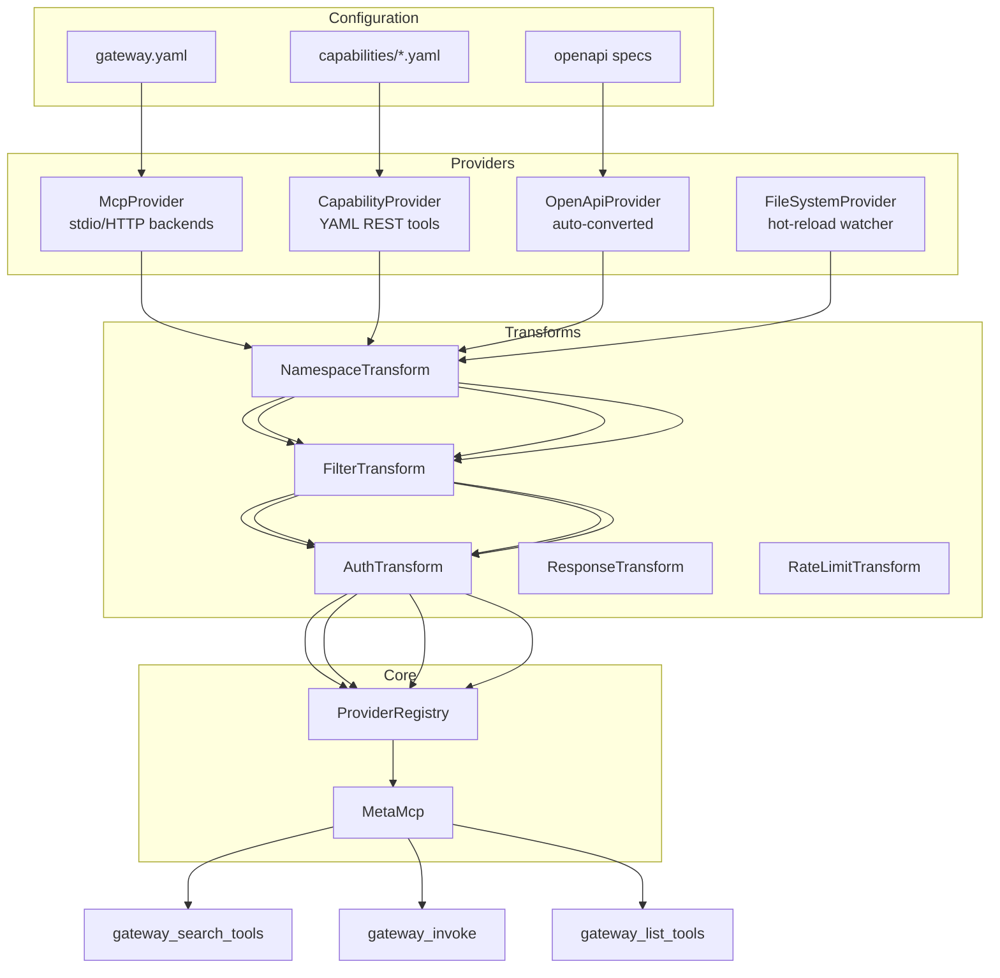

# RFC-0032: FastMCP 3.0 -- Providers, Transforms, and Playbooks

**Issue**: [#32](https://github.com/MikkoParkkola/mcp-gateway/issues/32)
**Status**: Proposed
**Date**: 2026-02-25

---

## Context

mcp-gateway currently has three separate mechanisms for sourcing tools:

1. **MCP Backends** (`src/backend/`) -- stdio/HTTP connections to MCP servers
2. **Capabilities** (`src/capability/`) -- YAML-defined REST API tools executed directly
3. **Playbooks** (`src/playbook.rs`) -- multi-step tool chains

These are wired independently into `MetaMcp` with separate code paths for discovery, invocation, and caching. Adding a new tool source (e.g., OpenAPI import, filesystem watcher, gRPC) requires touching `MetaMcp`, `BackendRegistry`, search, and routing -- a shotgun surgery anti-pattern.

FastMCP 3.0 (Python) introduced a clean abstraction: **Providers** (pluggable tool sources), **Transforms** (middleware on providers), and composed **Playbooks**. This RFC adapts that architecture to mcp-gateway's Rust codebase.

### What This Replaces

| Current | Proposed |
|---------|----------|
| `BackendRegistry` + `CapabilityBackend` | Unified `Provider` trait |
| Per-tool auth in `auth.rs` API keys | `AuthTransform` per-provider |
| `routing_profile.rs` allow/deny | `FilterTransform` per-provider |
| Ad-hoc namespace prefixes | `NamespaceTransform` |
| Hardcoded pipeline in `MetaMcp` | Composable `TransformChain` |

---

## Decision

### Provider Trait

A `Provider` is anything that can list and invoke tools. The trait unifies backends, capabilities, and future sources behind one interface.

```rust
/// A source of MCP tools.
#[async_trait]
pub trait Provider: Send + Sync + 'static {
    /// Unique name for this provider instance.
    fn name(&self) -> &str;

    /// List available tools (may be cached internally).
    async fn list_tools(&self) -> Result<Vec<Tool>>;

    /// Invoke a tool by name with JSON arguments.
    async fn invoke(&self, tool: &str, args: Value) -> Result<Value>;

    /// Health status of this provider.
    async fn health(&self) -> ProviderHealth;

    /// Optional: list resources (MCP resources/prompts).
    async fn list_resources(&self) -> Result<Vec<Resource>> {
        Ok(vec![])
    }
}
```

### Built-in Providers

| Provider | Wraps | Source |
|----------|-------|--------|
| `McpProvider` | Existing `Backend` | stdio/HTTP MCP servers |
| `CapabilityProvider` | Existing `CapabilityBackend` | YAML REST API definitions |
| `OpenApiProvider` | Existing `OpenApiConverter` | OpenAPI specs auto-converted |
| `FileSystemProvider` | New | Watch directory for YAML capabilities, hot-reload |
| `CompositeProvider` | New | Aggregates multiple providers into one |

### Transform Trait

Transforms wrap a provider and modify its behavior. They form a middleware chain, inspired by tower's `Layer`/`Service` pattern but specialized for the provider domain.

```rust
/// A transform wraps a provider, modifying tool lists and/or invocations.
#[async_trait]
pub trait Transform: Send + Sync + 'static {
    /// Transform the tool list (filter, rename, add metadata).
    async fn transform_tools(&self, tools: Vec<Tool>) -> Result<Vec<Tool>>;

    /// Transform an invocation request (modify args, check auth, etc.).
    /// Return None to block the invocation.
    async fn transform_invoke(
        &self,
        tool: &str,
        args: Value,
    ) -> Result<Option<(String, Value)>>;

    /// Transform the invocation result (shape output, redact fields).
    async fn transform_result(&self, tool: &str, result: Value) -> Result<Value>;
}
```

### Built-in Transforms

| Transform | Purpose | Maps to Existing |
|-----------|---------|-----------------|
| `NamespaceTransform` | Prefix tool names (`gmail_*`) | Implicit in capability naming |
| `FilterTransform` | Allow/deny tools by pattern | `RoutingProfile`, `ToolPolicy` |
| `AuthTransform` | Per-provider auth injection | `ResolvedApiKey.allowed_tools` |
| `RenameTransform` | Rename tools for consistency | New |
| `ResponseTransform` | Project/redact response fields | `src/transform.rs` pipeline |
| `CacheTransform` | Per-provider response caching | `ResponseCache` |
| `RateLimitTransform` | Per-provider rate limiting | `failsafe/rate_limiter.rs` |

### TransformChain

A `TransformChain` wraps a `Provider` with an ordered list of `Transform`s, itself implementing `Provider`:

```rust
pub struct TransformChain {
    inner: Box<dyn Provider>,
    transforms: Vec<Box<dyn Transform>>,
}

#[async_trait]
impl Provider for TransformChain {
    async fn list_tools(&self) -> Result<Vec<Tool>> {
        let mut tools = self.inner.list_tools().await?;
        for t in &self.transforms {
            tools = t.transform_tools(tools).await?;
        }
        Ok(tools)
    }

    async fn invoke(&self, tool: &str, args: Value) -> Result<Value> {
        // Run through transforms in order
        let mut current_tool = tool.to_string();
        let mut current_args = args;
        for t in &self.transforms {
            match t.transform_invoke(&current_tool, current_args).await? {
                Some((t, a)) => { current_tool = t; current_args = a; }
                None => return Err(Error::blocked(tool)),
            }
        }
        let result = self.inner.invoke(&current_tool, current_args).await?;
        // Run result transforms in reverse
        let mut result = result;
        for t in self.transforms.iter().rev() {
            result = t.transform_result(tool, result).await?;
        }
        Ok(result)
    }
}
```

### ProviderRegistry

Replaces `BackendRegistry` + `CapabilityBackend` management in `MetaMcp`:

```rust
pub struct ProviderRegistry {
    providers: DashMap<String, Arc<dyn Provider>>,
}

impl ProviderRegistry {
    /// List all tools across all providers.
    pub async fn all_tools(&self) -> Vec<(String, Tool)> { /* ... */ }

    /// Invoke a tool, routing to the correct provider.
    pub async fn invoke(&self, provider: &str, tool: &str, args: Value) -> Result<Value> {
        let p = self.providers.get(provider).ok_or(Error::not_found(provider))?;
        p.invoke(tool, args).await
    }
}
```

### Configuration Evolution

Current `servers.yaml` evolves to support providers and transforms declaratively:

```yaml
# Current (still supported, auto-converted to McpProvider)
backends:
  tavily:
    command: "npx -y @anthropic/mcp-server-tavily"

# New: explicit provider with transforms
providers:
  gmail:
    type: capability
    directory: ./capabilities/gmail
    transforms:
      - namespace: "gmail"           # Prefix all tools with gmail_
      - filter:
          allow: ["gmail_search", "gmail_send*"]
      - auth:
          require: "env:GMAIL_TOKEN"  # Injected at invocation time
      - response:
          project: ["id", "subject", "from", "snippet"]
          redact:
            - pattern: '\b[A-Za-z0-9._%+-]+@[A-Za-z0-9.-]+\.[A-Z|a-z]{2,}\b'
              replacement: "[REDACTED_EMAIL]"

  research:
    type: composite
    sources:
      - tavily                      # Reference another provider
      - brave
    transforms:
      - namespace: "research"
      - rate_limit:
          requests_per_second: 10

  # OpenAPI auto-import
  stripe:
    type: openapi
    spec_url: "https://raw.githubusercontent.com/stripe/openapi/master/openapi/spec3.json"
    transforms:
      - filter:
          allow: ["stripe_list_customers", "stripe_create_charge"]
      - auth:
          header: "Authorization"
          value: "Bearer {env.STRIPE_KEY}"
```

### Playbook Composition

Playbooks become a thin layer on top of providers. A playbook references providers by name and chains tool invocations:

```yaml
playbooks:
  morning_briefing:
    description: "Fetch email + calendar + weather"
    steps:
      - provider: gmail
        tool: gmail_search
        args: { query: "is:unread newer_than:1d", max_results: 5 }
        output: emails
      - provider: research
        tool: research_brave_web_search
        args: { query: "weather Helsinki today" }
        output: weather
    output:
      template: "## Emails\n{{emails}}\n## Weather\n{{weather}}"
```

This replaces the current `PlaybookDefinition` with explicit provider routing, making it clear which provider handles each step.

---

## Architecture Diagram



---

## Mapping to Existing Codebase

| Existing Component | File | Provider Migration |
|-------------------|------|-------------------|
| `BackendRegistry` | `src/backend/mod.rs` | Becomes `McpProvider` adapter |
| `CapabilityBackend` | `src/capability/backend.rs` | Becomes `CapabilityProvider` adapter |
| `CapabilityExecutor` | `src/capability/executor.rs` | Used internally by `CapabilityProvider` |
| `TransformConfig` | `src/transform.rs` | Becomes `ResponseTransform` |
| `ToolPolicy` | `src/security/policy.rs` | Becomes `FilterTransform` |
| `RoutingProfile` | `src/routing_profile.rs` | Becomes session-scoped `FilterTransform` |
| `PlaybookEngine` | `src/playbook.rs` | Refactored to use `ProviderRegistry` |
| `ResponseCache` | `src/cache.rs` | Becomes `CacheTransform` |
| `Failsafe` | `src/failsafe/` | Embedded in `McpProvider` (transport-level) |

---

## Implementation Phases

### Phase 1: Provider Trait and McpProvider (2 weeks)

- Define `Provider` trait in new `src/provider/mod.rs`
- Implement `McpProvider` wrapping existing `Backend`
- Implement `ProviderRegistry` as a thin layer over `DashMap<String, Arc<dyn Provider>>`
- Wire `ProviderRegistry` into `MetaMcp` alongside existing `BackendRegistry`
- Both code paths active (old and new) -- feature-gated

**Verification**: `gateway_list_tools` returns same results via provider path.

### Phase 2: CapabilityProvider + Transform Trait (2 weeks)

- Implement `CapabilityProvider` wrapping existing `CapabilityBackend`
- Define `Transform` trait
- Implement `TransformChain`
- Implement `NamespaceTransform`, `FilterTransform`
- Port `ToolPolicy` logic to `FilterTransform`

**Verification**: Capability tools listed and invocable through provider chain with namespace prefixes.

### Phase 3: Config Evolution + Remaining Transforms (2 weeks)

- Add `providers:` section to config schema (alongside `backends:`)
- Auto-convert `backends:` entries to `McpProvider` providers
- Implement `AuthTransform`, `ResponseTransform`, `RateLimitTransform`
- Implement `CacheTransform`

**Verification**: Full config-driven provider+transform chain operational.

### Phase 4: Playbook Integration + Cleanup (1 week)

- Refactor `PlaybookEngine` to use `ProviderRegistry.invoke()`
- Remove direct `BackendRegistry`/`CapabilityBackend` references from `MetaMcp`
- Deprecate old code paths behind feature gate

**Verification**: Playbooks execute through provider chain. E2E test suite green.

---

## Dependencies

- **Blocks #46**: Plugin system needs provider trait as extension point
- **Blocks #78**: Advanced routing needs transform chain for session-scoped filtering
- **Depends on**: Nothing (additive, wraps existing code)
- **Complements #43**: `AuthTransform` can inject temporary tokens from key server

---

## Effort Estimate

| Phase | Effort |
|-------|--------|
| Phase 1: Provider trait + McpProvider | 2 weeks |
| Phase 2: CapabilityProvider + Transforms | 2 weeks |
| Phase 3: Config + remaining transforms | 2 weeks |
| Phase 4: Playbook integration + cleanup | 1 week |
| **Total** | **7 weeks** |

---

## Risks and Mitigations

| Risk | Likelihood | Impact | Mitigation |
|------|-----------|--------|------------|
| Performance regression from dynamic dispatch | Medium | Medium | `Provider` is `Arc<dyn Provider>` -- same as current `Arc<dyn Transport>`. Benchmark before/after. |
| Breaking config changes | Low | High | `backends:` remains supported, auto-converted. Zero-breaking-change migration. |
| Transform ordering bugs | Medium | Medium | Fixed transform order (namespace -> filter -> auth -> response). Document clearly. |
| Complexity increase | Medium | Low | Provider/Transform traits are simpler than current 3-way MetaMcp dispatch. Net reduction in MetaMcp complexity. |
| Feature gate overhead | Low | Low | Use `cfg` feature flag during transition. Remove after Phase 4. |

---

## Decisions Needed

1. **Trait object vs enum dispatch**: `dyn Provider` (extensible, slower) vs `ProviderKind` enum (fast, closed set). Recommend trait objects for extensibility -- the overhead is negligible given network latency dominates.

2. **Transform ordering**: Fixed pipeline order vs user-configurable? Recommend fixed order with well-defined semantics to avoid footguns.

3. **Backward compatibility period**: How long to keep `backends:` as primary config? Recommend indefinite -- auto-conversion is cheap.

---

## References

- FastMCP 3.0 (Python): https://github.com/jlowin/fastmcp
- Tower middleware pattern: https://docs.rs/tower/latest/tower/
- Current transform pipeline: `src/transform.rs`
- Current capability system: `src/capability/mod.rs`
- Current backend registry: `src/backend/mod.rs`
