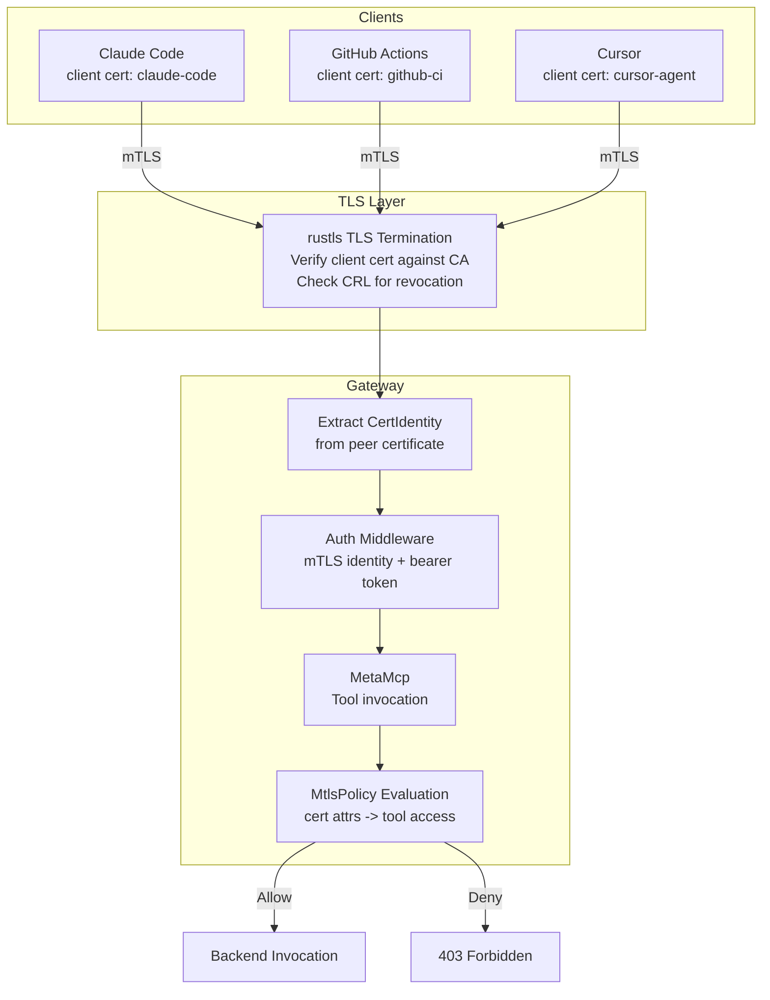

# RFC-0051: mTLS Authenticated Tool Access

**Issue**: [#51](https://github.com/MikkoParkkola/mcp-gateway/issues/51)
**Status**: Proposed
**Date**: 2026-02-25

---

## Context

mcp-gateway currently authenticates clients at the application layer via bearer tokens and API keys (`src/gateway/auth.rs`). This works for human-driven flows but is insufficient for machine-to-machine (M2M) scenarios where:

1. **Agent identity must be cryptographically verifiable** -- bearer tokens can be forwarded, shared, or leaked. X.509 certificates bind identity to a private key.
2. **Zero-trust networking** -- in multi-tenant or cloud deployments, transport-level authentication prevents unauthorized connections before any application code runs.
3. **Certificate-based authorization** -- tool access policies can be derived from certificate attributes (CN, SAN, OU), enabling YAML-driven per-agent access control without token management.

### Relationship to Other Auth Mechanisms

| Layer | Mechanism | Purpose | When |
|-------|-----------|---------|------|
| Transport | **mTLS** (this RFC) | Authenticate the connection | Before HTTP parsing |
| Application | Bearer token / API key | Authenticate the request | After HTTP parsing |
| Application | Key Server (#43) | Identity-based temp tokens | After OIDC verification |

These layers are complementary. mTLS authenticates *what is connecting* (certificate identity). Application-layer auth authenticates *who is requesting* (human/service identity). Both can be active simultaneously.

---

## Decision

### Certificate Hierarchy

Three-level PKI hierarchy with the gateway operator as the trust root:

```
Root CA (offline, long-lived)
  |
  +-- Server Certificate (gateway)
  |     CN: gateway.company.com
  |     SAN: DNS:gateway.company.com, IP:10.0.0.1
  |
  +-- Client Certificates (agents)
        |
        +-- CN: claude-code-agent
        |   OU: engineering
        |   SAN: URI:spiffe://company.com/agent/claude-code
        |
        +-- CN: github-actions-ci
        |   OU: ci-cd
        |   SAN: URI:spiffe://company.com/ci/github-actions
        |
        +-- CN: cursor-agent
            OU: engineering
            SAN: URI:spiffe://company.com/agent/cursor
```

**Root CA** is generated once, stored offline (or in a vault). It signs server and client certificates. For production, an intermediate CA is recommended but not required for initial deployment.

### Certificate Fields for Authorization

| Certificate Field | Authorization Use |
|-------------------|-------------------|
| `CN` (Common Name) | Agent identity (used in audit logs) |
| `OU` (Organizational Unit) | Group-based policy matching |
| `SAN URI` | SPIFFE-compatible workload identity |
| `SAN DNS` | Hostname-based access (for server-to-server) |
| Custom Extension OID | Future: embedded policy attributes |

### rustls Integration

mcp-gateway uses `axum` + `tokio` for HTTP. TLS termination is added via `axum-server` with `rustls`:

```rust
use axum_server::tls_rustls::RustlsConfig;
use rustls::server::WebPkiClientVerifier;

/// Build TLS config with mutual authentication.
fn build_mtls_config(config: &MtlsConfig) -> Result<rustls::ServerConfig> {
    // 1. Load server certificate chain
    let server_certs = load_certs(&config.server_cert)?;
    let server_key = load_private_key(&config.server_key)?;

    // 2. Load CA certificates for client verification
    let mut root_store = rustls::RootCertStore::empty();
    let ca_certs = load_certs(&config.ca_cert)?;
    for cert in &ca_certs {
        root_store.add(cert.clone())?;
    }

    // 3. Build client verifier
    let client_verifier = if config.require_client_cert {
        WebPkiClientVerifier::builder(Arc::new(root_store))
            .with_crls(load_crls(&config.crl_path)?)
            .build()?
    } else {
        WebPkiClientVerifier::builder(Arc::new(root_store))
            .allow_unauthenticated()
            .build()?
    };

    // 4. Build server config
    let mut tls_config = rustls::ServerConfig::builder()
        .with_client_cert_verifier(client_verifier)
        .with_single_cert(server_certs, server_key)?;

    tls_config.alpn_protocols = vec![b"h2".to_vec(), b"http/1.1".to_vec()];
    Ok(tls_config)
}
```

### Policy-Based Tool Authorization

Tool access policies are defined in YAML, keyed on certificate attributes:

```yaml
mtls:
  enabled: false
  server_cert: "/etc/mcp-gateway/tls/server.crt"
  server_key: "/etc/mcp-gateway/tls/server.key"
  ca_cert: "/etc/mcp-gateway/tls/ca.crt"
  require_client_cert: true

  # Optional: CRL for revocation
  crl_path: "/etc/mcp-gateway/tls/crl.pem"

  # Certificate-based tool access policies
  policies:
    # Engineering agents get full access
    - match:
        ou: "engineering"
      allow:
        backends: ["*"]
        tools: ["*"]

    # CI/CD agents get read-only search tools
    - match:
        cn: "github-actions-ci"
      allow:
        backends: ["tavily", "brave"]
        tools: ["*_search*", "*_list*"]
      deny:
        tools: ["*_write*", "*_delete*", "*_create*"]

    # SPIFFE identity matching
    - match:
        san_uri: "spiffe://company.com/agent/*"
      allow:
        backends: ["*"]
        tools: ["*"]
      deny:
        tools: ["write_file", "delete_file", "run_command"]

    # Default: deny all (if no policy matches)
    - match: { any: true }
      deny:
        backends: ["*"]
        tools: ["*"]
```

### Policy Evaluation

Policy evaluation follows the same first-match-wins pattern as `ToolPolicy` and `RoutingProfile`:

```rust
pub struct MtlsPolicy {
    rules: Vec<MtlsPolicyRule>,
}

pub struct MtlsPolicyRule {
    match_criteria: CertMatchCriteria,
    allow: ToolScope,
    deny: ToolScope,
}

pub struct CertMatchCriteria {
    cn: Option<String>,       // Exact or glob match on Common Name
    ou: Option<String>,       // Exact or glob match on Organizational Unit
    san_uri: Option<String>,  // Glob match on SAN URI
    san_dns: Option<String>,  // Glob match on SAN DNS
    any: Option<bool>,        // Match any valid certificate
}

impl MtlsPolicy {
    /// Evaluate tool access for a verified client certificate.
    fn evaluate(&self, cert_identity: &CertIdentity, tool: &str, backend: &str) -> PolicyDecision {
        for rule in &self.rules {
            if rule.match_criteria.matches(cert_identity) {
                if rule.deny.matches_tool(tool) || rule.deny.matches_backend(backend) {
                    return PolicyDecision::Deny;
                }
                if rule.allow.matches_tool(tool) && rule.allow.matches_backend(backend) {
                    return PolicyDecision::Allow;
                }
                return PolicyDecision::Deny; // Matched rule but not in allow list
            }
        }
        PolicyDecision::Deny // No rule matched
    }
}
```

### Integration with Existing Auth

mTLS operates at the transport layer, before the existing auth middleware:

```
TCP connection
  -> TLS handshake (rustls verifies client cert against CA)
  -> Extract CertIdentity from peer certificate
  -> Inject into request extensions
  -> [Existing auth middleware runs]
  -> [mTLS policy check on tool invocation]
```

The `CertIdentity` is extracted during the TLS handshake and injected into Axum's request extensions, making it available to downstream handlers:

```rust
/// Middleware to extract client certificate identity.
pub async fn mtls_identity_middleware(
    ConnectInfo(addr): ConnectInfo<SocketAddr>,
    mut request: Request<Body>,
    next: Next,
) -> Response {
    // rustls provides peer certificates via connection info
    if let Some(certs) = request.extensions().get::<Vec<CertificateDer>>() {
        if let Some(cert) = certs.first() {
            match extract_cert_identity(cert) {
                Ok(identity) => {
                    request.extensions_mut().insert(identity);
                }
                Err(e) => {
                    warn!("Failed to extract cert identity: {}", e);
                }
            }
        }
    }
    next.run(request).await
}
```

### How Auth Layers Combine

When both mTLS and application-layer auth are enabled:

```
1. mTLS: Connection authenticated (or rejected at TLS level)
2. Auth middleware: Token validated (static key or key server temp token)
3. Tool invocation:
   a. ToolPolicy check (existing, from security config)
   b. RoutingProfile check (existing, session-scoped)
   c. MtlsPolicy check (new, certificate-scoped)
   d. All must pass -> tool invoked
```

The mTLS policy is an additional gate, not a replacement. This follows defense-in-depth -- compromising one layer does not grant full access.

---

## Certificate Lifecycle

### Generation

Provide a helper command for operators:

```bash
# Generate Root CA (one-time, store securely)
mcp-gateway tls init-ca --out /etc/mcp-gateway/tls/

# Generate server certificate
mcp-gateway tls issue-server \
  --ca-cert /etc/mcp-gateway/tls/ca.crt \
  --ca-key /etc/mcp-gateway/tls/ca.key \
  --cn gateway.company.com \
  --san "DNS:gateway.company.com,IP:10.0.0.1" \
  --out /etc/mcp-gateway/tls/server

# Generate client certificate for an agent
mcp-gateway tls issue-client \
  --ca-cert /etc/mcp-gateway/tls/ca.crt \
  --ca-key /etc/mcp-gateway/tls/ca.key \
  --cn claude-code-agent \
  --ou engineering \
  --san "URI:spiffe://company.com/agent/claude-code" \
  --out ~/.mcp-gateway/tls/claude-code
```

These commands wrap `rcgen` (Rust certificate generation library) to produce PEM files. Operators with existing PKI infrastructure can skip these and provide their own certificates.

### Where Certificates Live

| Certificate | Location | Who Accesses |
|-------------|----------|-------------|
| Root CA cert | `/etc/mcp-gateway/tls/ca.crt` | Gateway (for client verification) |
| Root CA key | Offline / Vault | Only for signing new certs |
| Server cert + key | `/etc/mcp-gateway/tls/server.{crt,key}` | Gateway process |
| Client cert + key | `~/.mcp-gateway/tls/{name}.{crt,key}` | Each agent |
| CRL | `/etc/mcp-gateway/tls/crl.pem` | Gateway (for revocation checks) |

### Rotation

Certificate rotation uses the `notify` file watcher (already used for config hot-reload):

```rust
// Watch TLS certificate files for changes
let tls_watcher = TlsCertificateWatcher::new(
    &config.mtls.server_cert,
    &config.mtls.server_key,
    &config.mtls.ca_cert,
);

// On change: rebuild rustls config, swap via ArcSwap
tls_watcher.on_change(|new_config| {
    tls_config_handle.swap(Arc::new(new_config));
    info!("TLS certificates reloaded");
});
```

**Rotation procedure**:
1. Issue new certificate (new expiry, same or new key)
2. Place new cert files in the configured paths
3. Gateway detects file change, reloads TLS config
4. Existing connections continue with old cert until they close
5. New connections use new cert

Zero downtime. No restart required.

### Revocation

Two mechanisms:

1. **CRL (Certificate Revocation List)**: Gateway loads a CRL file and checks it during TLS handshake. CRL is reloaded on file change (same watcher as cert rotation).

2. **Short-lived certificates**: Issue client certs with 24-hour expiry. No revocation needed -- just stop issuing new certs for compromised agents. This is the recommended approach for agent certificates.

OCSP is not implemented in the initial version -- CRL and short-lived certs cover the common cases.

---

## How Agents Present Certificates

### Claude Code / CLI

Configure via environment variables or config file:

```bash
# Environment variables
export MCP_GATEWAY_CLIENT_CERT=~/.mcp-gateway/tls/claude-code.crt
export MCP_GATEWAY_CLIENT_KEY=~/.mcp-gateway/tls/claude-code.key
export MCP_GATEWAY_CA_CERT=~/.mcp-gateway/tls/ca.crt

# Or in claude-desktop.json / cursor-settings.json
{
  "mcpServers": {
    "gateway": {
      "url": "https://gateway.company.com:39400/mcp",
      "tls": {
        "clientCert": "~/.mcp-gateway/tls/claude-code.crt",
        "clientKey": "~/.mcp-gateway/tls/claude-code.key",
        "caCert": "~/.mcp-gateway/tls/ca.crt"
      }
    }
  }
}
```

### GitHub Actions

```yaml
jobs:
  ai-task:
    steps:
      - name: Configure mTLS
        run: |
          echo "${{ secrets.AGENT_CLIENT_CERT }}" > /tmp/client.crt
          echo "${{ secrets.AGENT_CLIENT_KEY }}" > /tmp/client.key
          echo "${{ secrets.GATEWAY_CA_CERT }}" > /tmp/ca.crt

      - name: Call Gateway
        run: |
          curl --cert /tmp/client.crt \
               --key /tmp/client.key \
               --cacert /tmp/ca.crt \
               -X POST https://gateway.company.com:39400/mcp \
               -d '{"jsonrpc":"2.0","id":1,"method":"tools/list"}'
```

### Programmatic (reqwest)

```rust
let client = reqwest::Client::builder()
    .identity(reqwest::Identity::from_pem(&cert_and_key_pem)?)
    .add_root_certificate(reqwest::Certificate::from_pem(&ca_pem)?)
    .build()?;

let response = client
    .post("https://gateway.company.com:39400/mcp")
    .json(&json_rpc_request)
    .send()
    .await?;
```

---

## Architecture Diagram



---

## Implementation Phases

### Phase 1: TLS Termination with rustls (1.5 weeks)

- Add `axum-server`, `rustls`, `rustls-pemfile` dependencies
- Implement `build_mtls_config()` -- server cert + optional client verification
- Add `mtls` section to config schema
- Wire TLS into `src/gateway/server.rs` startup
- Support `require_client_cert: false` for TLS-only (no mutual auth)

**Verification**: Gateway serves HTTPS. Clients without valid certs are rejected when `require_client_cert: true`.

### Phase 2: Certificate Identity Extraction + Policy (1.5 weeks)

- `src/security/mtls.rs` -- `CertIdentity`, `MtlsPolicy`, `CertMatchCriteria`
- Extract CN, OU, SAN from peer certificate during handshake
- Inject `CertIdentity` into request extensions
- YAML policy evaluation (first-match-wins)
- Wire policy check into tool invocation path in `MetaMcp`

**Verification**: Different client certificates get different tool access based on policy YAML.

### Phase 3: Certificate Lifecycle CLI (1 week)

- `mcp-gateway tls init-ca` -- generate self-signed CA
- `mcp-gateway tls issue-server` -- generate server cert signed by CA
- `mcp-gateway tls issue-client` -- generate client cert signed by CA
- Add `rcgen` dependency for certificate generation
- Certificate file watcher for rotation (extend existing `notify` watcher)

**Verification**: Full lifecycle: generate CA -> issue certs -> connect with mTLS -> rotate cert -> reconnect.

### Phase 4: CRL + Short-Lived Certs (0.5 weeks)

- CRL loading and checking in rustls `ClientCertVerifier`
- CRL file watcher for hot-reload
- Document short-lived certificate pattern as recommended practice
- Audit logging for cert-based auth events

**Verification**: Revoked certificate is rejected. CRL update takes effect without restart.

---

## Dependencies

- **Independent**: Does not depend on #32 or #43
- **Complements #43**: mTLS (transport) + key server (application) = defense in depth
- **Complements #32**: `AuthTransform` can read `CertIdentity` from request extensions

---

## Effort Estimate

| Phase | Effort |
|-------|--------|
| Phase 1: TLS termination with rustls | 1.5 weeks |
| Phase 2: Cert identity extraction + policy | 1.5 weeks |
| Phase 3: Certificate lifecycle CLI | 1 week |
| Phase 4: CRL + short-lived certs | 0.5 weeks |
| **Total** | **4.5 weeks** |

---

## Risks and Mitigations

| Risk | Likelihood | Impact | Mitigation |
|------|-----------|--------|------------|
| Certificate management complexity | High | Medium | Provide `mcp-gateway tls` CLI commands. Document simple PKI setup. |
| Performance overhead of TLS | Low | Low | rustls is fast. HTTP/2 over TLS amortizes handshake cost. Benchmark. |
| Client compatibility (cert presentation) | Medium | Medium | Test with curl, reqwest, Claude Code, Cursor. Provide config examples for each. |
| CRL staleness | Medium | Low | Use short-lived certs as primary revocation strategy. CRL is supplementary. |
| `unsafe_code` in TLS deps | Low | Low | `rustls` is memory-safe Rust. No `unsafe` in gateway code (enforced by `#![forbid(unsafe_code)]`). |

---

## New Dependencies

| Crate | Purpose | Size | `unsafe` |
|-------|---------|------|----------|
| `rustls` | TLS implementation | ~50KB | No (pure Rust) |
| `rustls-pemfile` | PEM file parsing | ~10KB | No |
| `axum-server` | TLS-enabled axum server | ~20KB | No |
| `rcgen` | Certificate generation (CLI only) | ~30KB | No |
| `x509-parser` | Certificate field extraction | ~40KB | Minimal (ASN.1 parsing) |

All are well-maintained, widely used, and compatible with the project's `#![forbid(unsafe_code)]` policy (gateway code itself remains `unsafe`-free).

---

## Decisions Needed

1. **TLS library**: `rustls` (pure Rust, no OpenSSL dependency) vs `native-tls` (wraps system TLS). Recommend `rustls` -- it aligns with the project's no-`unsafe` policy and avoids OpenSSL build complexity.

2. **Certificate generation**: `rcgen` (Rust) vs shelling out to `openssl` CLI. Recommend `rcgen` -- no external dependency, cross-platform, testable.

3. **SPIFFE support**: Include SPIFFE URI SAN matching from day one, or add later? Recommend including it -- the implementation cost is one additional SAN type check, and it enables Kubernetes/service-mesh integration.

4. **Default mode**: When `mtls.enabled: true`, should `require_client_cert` default to `true` (strict) or `false` (optional)? Recommend `true` -- if you enable mTLS, you want it enforced. Optional mode is useful during migration but should be explicit.

---

## References

- rustls documentation: https://docs.rs/rustls/latest/rustls/
- axum-server TLS: https://docs.rs/axum-server/latest/axum_server/tls_rustls/
- rcgen certificate generation: https://docs.rs/rcgen/latest/rcgen/
- SPIFFE specification: https://spiffe.io/docs/latest/spiffe-about/overview/
- X.509 certificate fields: RFC 5280
- CRL format: RFC 5280 Section 5
- Current auth middleware: `src/gateway/auth.rs`
- Current security policy: `src/security/policy.rs`
- File watcher (hot-reload): `src/capability/watcher.rs`, `src/config_reload.rs`
