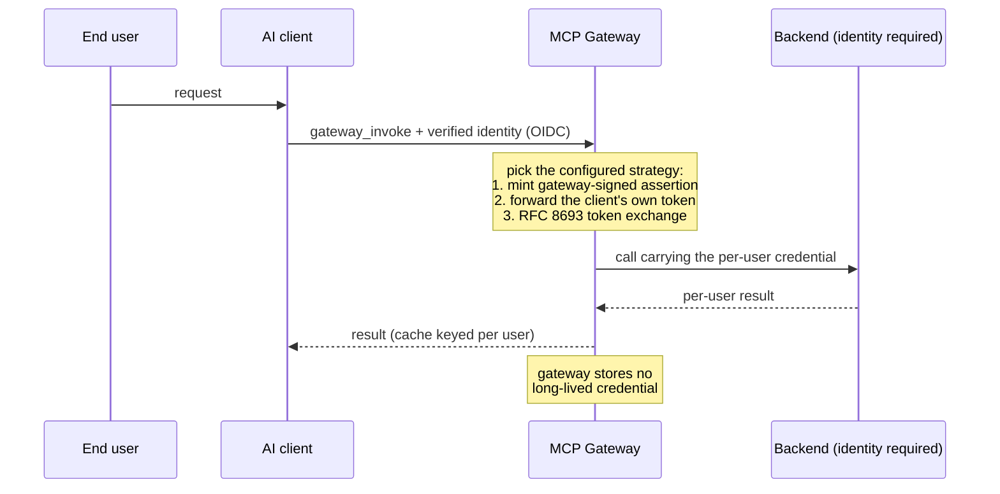

# What is new in v3.1.0: end-user identity to backends

A multitenant backend (email, memory, calendar) that runs its own OIDC normally sees only "the gateway." It cannot tell which user is calling, so it cannot enforce per-user access. It cannot produce a per-user audit trail either. Sharing one static backend credential across every caller is the usual workaround, and it erases the user boundary.

The 3.0 line introduced identity propagation: a strategy-agnostic `IdentityPropagation` trait that carries the full verified identity through dispatch to the backend-invoke boundary, plus a gateway-signed assertion strategy and RFC 9728 metadata advertisement. v3.1.0 completes the picture with a third outbound strategy, RFC 8693 token exchange, so OAuth-native third-party backends are now covered by the same trait and the same safety invariants. Throughout, the gateway holds no long-lived credential for anyone.

Three outbound strategies ship in 3.1.0, none of which stores a long-lived secret:

- **Signed-assertion strategy.** The gateway mints a short-lived ES256 assertion (`sub`, `email`, `tenant`, `aud`, with `exp`/`nbf`/`jti`) signed by its own key. Backends that trust the gateway verify it. This serves first-party, gateway-trusting backends and needs no external IdP. Wired across meta-MCP dispatch (`gateway_invoke`), Code Mode (`gateway_execute`), and the direct backend route (`/mcp/{name}`).
- **Client-supplied token passthrough.** A caller can attach its own backend credential on the request. The gateway forwards it verbatim and keeps no copy.
- **RFC 8693 token exchange.** For OAuth-native third-party backends (for example Gmail), the gateway exchanges the verified identity for a scoped, short-lived backend token at call time. The strategy is implemented on the same `IdentityPropagation` trait (`src/identity_propagation/token_exchange.rs`), selected on the live invoke path (`src/gateway/meta_mcp/invoke.rs`), and constructed at production startup (`src/gateway/server/mod.rs`). It activates only when an operator configures a backend for the `token_exchange` strategy; a backend with no strategy keeps today's static-credential behavior unchanged.

The gateway also carries forward RFC 9728 protected-resource metadata from the 3.0 line. It advertises each backend's OAuth requirements so a capable client can run its own browser login and attach its own token per request, instead of relying on a gateway-held credential.

The safety invariants are the release gate, not any single auth model:

- **Fail-closed.** A backend marked `required` refuses the call rather than downgrade to a shared credential when there is no verified identity, no strategy wired, or minting fails.
- **Tenant isolation.** A credential for `(user, backend, audience)` is scoped to exactly that tuple and never cross-presented.
- **Session isolation.** An identity-required backend must either use per-user session instances or declare itself `stateless`; otherwise the gateway refuses rather than reuse a shared backend session across users.
- **Cache awareness.** Response and idempotency caches key on the per-user credential binding, or bypass the cache, so one user never receives another user's cached result.
- **Audit.** Each propagation event is written to a signed transparency log with subject, backend, and audience, never the token bytes. For a required backend, an audit-write failure is itself fail-closed.

The token-exchange endpoint is a separate, opt-in facility. The OIDC-backed key server exposes `POST /auth/token` (`src/key_server/handler.rs`) to mint short-lived, scoped gateway tokens from a verified OIDC identity. The key server is disabled by default and is enabled with `key_server.enabled: true`. It is distinct from outbound backend propagation: one issues gateway tokens, the other attaches credentials to backend calls.

Related defaults changed in the 3.0 line. On a multi-user gateway, a backend that requires a per-user OAuth identity refuses a call that lacks one instead of serving a shared stored token. Opt back into shared-credential behavior with `auth.single_user: true` for a personal gateway or `oauth.shared_account: true` for a specific backend. Upgrading from 2.x backs up `gateway.yaml`, detects your posture, and prints a one-time notice. It changes no config automatically. See [docs/UPGRADING-3.0.md](UPGRADING-3.0.md), [ADR-007](adr/ADR-007-identity-propagation.md), and [ADR-008](adr/ADR-008-multi-user-oauth-isolation.md).
